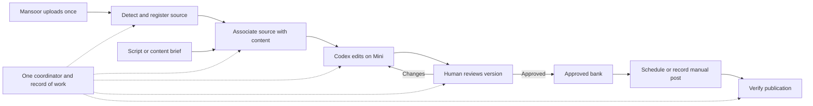

# Mansoor workflow: VM evidence audit and simplification

Evidence captured September 15–16, 2026. This report supersedes the VM assumptions and SSH blocker in WORKING-AUDIT.md. It does not claim that every historical conversation, every media file, or every live service has been examined. Nothing in the production workflow was changed.

The central finding is that the creative workflow is reasonably well specified, but its bookkeeping is divided between agent turns, several databases, JSON files, provider records, and manual work. The intended experience is simple; the implementation depends on too many handoffs being remembered and completed. Your recent manual editing and publishing exposed that weakness. It did not create all of it.

## 1. Evidence and limits

The archive was retrieved over SSH with host-key verification enabled. The trusted ED25519 fingerprint is `SHA256:HqlJdlTdEMN/42JQUweTlWheZ0DHqLW93eydU8+5f+U`.

Archive SHA-256 matches exactly: `05d43145703b5519c46f4d811e76aa7dc3b6f0ca5f9078de85dcb4e38a642f48`.

All **2,915 manifest entries** match their bytes inside the archive. macOS extraction consumes some AppleDouble metadata entries, so integrity was checked against the tar stream itself. [Integrity results](evidence/vm/integrity.json).

The source comparison found 815 identical, 44 different, and 1,043 VM-only files under the operations tree. These counts include jobs, backups and evidence—not just executable code. The four core files previously examined on the Mini—`sweeper.py`, `pm_repair.py`, `revision_completeness_gate.py`, and `ready_to_post.py`—are byte-identical to the archive versions. [Full comparison](evidence/vm/local-vm-comparison.json).

I read the entry documents, current operational contracts, relevant agent profiles and memories, raw automation configurations, intake/copycat/publishing skills, key implementation paths, project rules, and state exports. I also inspected historical audit events and compared deployed files. Hashing or indexing a file is not the same as reading it. Large historical logs, unrelated agents, redundant backups, and every editor reference have not received exhaustive line-by-line review. [File inventory](evidence/vm/archive-file-inventory.json).

The archive excludes credentials, media, conversation databases, and live Notion. Its `limit500` exports are snapshots; one attempted recent-jobs CSV contains a SQL error, not job records. Muse was not found by the collector on this VM; that does not establish its involvement elsewhere. [Exclusions](/Users/ivanclawd/Downloads/mansoor-codex-handoff-2026-09-16/EXCLUDED.md), [identity](/Users/ivanclawd/Downloads/mansoor-codex-handoff-2026-09-16/IDENTITY.md), [state summary](evidence/vm/state-summary.json).

A subsequent read-only SSH check confirmed current reaction settings and retrieved the separate sweeper state file. [Live snapshot](evidence/vm/live-readonly-snapshot.json).

## 2. What the workflow was intended to accomplish

Mansoor supplies ideas, footage and approvals. Ivan directs strategy and quality. The system turns those into individual, traceable deliverables and makes the next human action obvious. Filing, copying statuses between apps and remembering whether something was posted should not be Ivan's job.

The canonical strategy uses two distinct licensed US life-insurance audiences: sales-heavy solo agents and team-heavy operators who need stronger sales systems. Targeted scripted reels support conversion; discovery content supports reach; VSL and thank-you assets serve different parts of the funnel. These are strategy instructions in the files, not independent verification of the financial claims they contain. [Canonical context](/Users/ivanclawd/Downloads/mansoor-codex-handoff-2026-09-16/sources/mansoor-content-operations/context/mansoor/02_ICP_PROFILES.md).

Three distinctions already exist in the documentation and should survive simplification:

- A **Source** is a recording, reference or reusable media package. It can produce no deliverables, one deliverable, or many.
- A **Content Object** is one independently reviewable outcome. A long sales recording can create several clips; B-roll need not create any task by itself.
- A **Revision** is a particular edit of an existing object. A new export must not become a new unrelated content object.

## 3. Reconstructed workflow, including the boundaries

| Stage | Documented behavior | Where responsibility currently passes |
|---|---|---|
| Idea capture | Human message in `sf-ideas-inbox`; save original reference and Ivan's instruction; acknowledge receipt | Slack → Content Manager → Content PM action plans |
| Reference acquisition | Obtain actual source evidence/transcript; retry acquisition instead of inventing source contents | Coordinator/acquisition helpers → Idea Guy |
| Analysis and writing | Select one ICP and exact format; Codex analyzes and writes; do not silently substitute unsupported formats | Idea Guy wrapper → Codex → Content Manager |
| Script review | Human edits Notion page body; comments hold revision notes; script-ready Slack message links to the page | Notion/Slack → Content Manager |
| Script approval | Copy approved body into machine `Script` property, lock it, assign Mansoor, show it in Film Next; brain reaction additionally learns from edits | Reaction → PM → real Notion writes/readback |
| Upload intake | One Drive inbox; specifically formatted upload-complete Slack message; inspect media, identify package, rename and move without changing Drive IDs | Sweeper agent → Codex sweeper |
| Association | Match scripted footage to its script; create Source and zero-to-many clips for unscripted recordings | Sweeper result → Content Manager/PM matching |
| Editing | Exact format skill, editable project, original-source mapping, QC and export; revisions retain identity | MVE wrapper → Codex editor |
| Review | Frame version/comments for talking-head and sales clips; Slack review message; memo requests pickup | Slack → MVE → same editor context |
| Approval and bank | Video checkmark → Notion Ready to Post plus Drive day/funnel placement; no extra ready-to-post Slack message | Content Manager → PM + ready-to-post filer |
| Scheduling and publishing | Batch future banked days through Post Bridge; verify each platform separately | Planned code/skill → Post Bridge; autonomous publisher remains inactive |

Sources: [Content PM](/Users/ivanclawd/Downloads/mansoor-codex-handoff-2026-09-16/sources/mansoor-content-operations/CONTENT_PM.md), [Idea Guy](/Users/ivanclawd/Downloads/mansoor-codex-handoff-2026-09-16/sources/mansoor-content-operations/IDEA_GUY.md), [hybrid script contract](/Users/ivanclawd/Downloads/mansoor-codex-handoff-2026-09-16/sources/mansoor-content-operations/HYBRID_SCRIPT_MODEL_LOCKED.md), [sweeper](/Users/ivanclawd/Downloads/mansoor-codex-handoff-2026-09-16/sources/workflows/mansoor-drive-sweeper/SKILL.md), [daily scheduling](/Users/ivanclawd/Downloads/mansoor-codex-handoff-2026-09-16/sources/workflows/mansoor-daily-post-bridge-schedule/SKILL.md).

The hybrid script model has a sensible purpose: a comfortable human editor during review and a frozen machine snapshot after approval. The defect is not the existence of both representations. The missing protection is reliable version binding and reconciliation when a person edits or films outside the expected sequence.

The copycat lane is materially different. It uses lifestyle-copycats, Drive comments, its own review emojis, and a three-export pack: text, no text and mirrored footage with normal text. It must not be silently routed through talking-head review rules. [Copycat editor](/Users/ivanclawd/Downloads/mansoor-codex-handoff-2026-09-16/sources/codex-skills/mansoor-tof-copycat-editor/SKILL.md).

## 4. What is actually enabled and what has evidence of execution

| Component | Observed state | Meaning |
|---|---|---|
| Drive upload listener | Enabled | A qualifying Slack message can wake it; uploading alone is insufficient |
| Idea inbox main listener | Enabled | Message intake continues |
| Separate idea eyes listener | Enabled | Same message surface also wakes an acknowledgment-only path |
| Pipeline snapshots | Enabled; two cron listeners | Reporting continues; reporting is not reconciliation |
| Script brain listener | Disabled | No automatic brain approval/learning through this routine |
| SF video approval listener | Disabled | Checkmark-to-bank routine is paused |
| MVE memo/reject listener | Disabled | Revision/rejection routine is paused |
| MVE auto-dispatch revisions | False | Old revisions must not restart as an audit side effect |
| Lifestyle copycat review | Enabled | A separate active lane remains despite SF pauses |
| Social Media Manager | Explicitly planned/incomplete | No demonstrated autonomous end-to-end publishing service |

[Raw automations](/Users/ivanclawd/Downloads/mansoor-codex-handoff-2026-09-16/runtime/automations-raw), [live readback](evidence/vm/live-readonly-snapshot.json), [scheduler configuration](/Users/ivanclawd/Downloads/mansoor-codex-handoff-2026-09-16/sources/mansoor-content-operations/config/mve-scheduler.json).

**The pauses are intentional.** MVE's September 11 memory records Ivan's stop-all-revisions instruction. Audit events show workers being stopped, queues cancelled and flags cleared. Content Manager's September 13 memory records the later pause of script/video reaction triggers. Current settings agree. There is no separate plain script-checkmark listener in the inspected current automation files; the current absence must be interpreted alongside that pause, not presented as proof nobody ever implemented approvals. [MVE history](/Users/ivanclawd/Downloads/mansoor-codex-handoff-2026-09-16/sources/agent-data/agents/5d467b50-f8ae-471d-8726-8b8e72895990/memory/log/2026-09.md), [CM history](/Users/ivanclawd/Downloads/mansoor-codex-handoff-2026-09-16/sources/agent-data/agents/95af81fb-5344-4f38-bd01-cfe2d802a21c/memory/log/2026-09.md), [extracted audit events](evidence/vm/pause-audit-events.json).

State exports show:

- Sweeper wrapper: **one DRY_RUN assignment**. Separately, live `state.json` records four processed Slack timestamps, one replied timestamp, eleven processed Drive IDs and six destination packages. Earlier/manual filing happened; the wrapper database does not prove a production run of the rewritten worker.
- Idea Guy: **36 assignments**, 34 awaiting review and two complete. These include both analysis and writing jobs, so they are not 36 unique videos.
- PM: **40 objects**, **19 pending Notion actions** out of 48; pending does not prove the external operation failed—it means this store lacks completion acknowledgment.
- MVE: **13 jobs**, ten awaiting review and three stopped; six of the ten awaiting-review rows also carry a stop instruction in `last_error`.
- MVE assets: **12 rows**, seven missing a Content Object ID and six missing a Frame asset ID.
- Ready-to-post ledger: **two smoke dry runs**, no production filing receipt in that ledger. This does not prove no one ever copied or published a video elsewhere.

[Database exports](/Users/ivanclawd/Downloads/mansoor-codex-handoff-2026-09-16/state/sqlite), [pending actions](evidence/vm/pending-notion.json), [ready-to-post ledger](/Users/ivanclawd/Downloads/mansoor-codex-handoff-2026-09-16/state/ledgers/ready-to-post-ledger.jsonl).

## 5. Concrete causes of debt

### Intake does not meet the current desired experience

The deployed sweeper demands a new message in one channel, from an allowlisted sender, mentioning Composio and containing “upload complete.” It forbids Drive polling. It acknowledges with a green check before filing. A green check therefore means “trigger received,” not “files organized.”

The workflow skill explicitly forbids Notion writes. Content Manager expects structured upload results and owns downstream readiness, but the sweeper wrapper does not implement the complete association-and-dispatch bridge. Earlier Eddie memory also explicitly lists automatic match-footage as a gap. This is more precise than my earlier local-only description of conflicting instructions: **on the VM, the deployed sweeper is narrower than the larger content workflow expects.**

The wrapper deduplicates Slack events, not a complete cross-system asset lifecycle. It considers nonempty worker final text sufficient for its completion flag. Its concurrency reads the shared MVE `codex_workers` setting—currently six—while the skill says never run two move passes over the same inbox. I found no queue-drain command in its CLI. These need code-level guarantees, not another paragraph in the worker prompt. [sweeper.py](/Users/ivanclawd/Downloads/mansoor-codex-handoff-2026-09-16/sources/mansoor-content-operations/tools/drive-sweeper/sweeper.py:194), [completion check](/Users/ivanclawd/Downloads/mansoor-codex-handoff-2026-09-16/sources/mansoor-content-operations/tools/drive-sweeper/sweeper.py:604).

### Matching can be confident without adequate evidence

`pm_repair.py` can use an explicitly supplied object's canonical script when no transcript was supplied, effectively comparing the script with itself. Candidate filtering focuses on Ready to Film/Uploaded; already-filmed scripts still in review can be missed. Filename/title similarity contributes to scores despite the intake doctrine requiring actual media evidence. Empty required-file lists weaken the readiness check. [Matching implementation](/Users/ivanclawd/Downloads/mansoor-codex-handoff-2026-09-16/sources/mansoor-content-operations/tools/content-os/pm_repair.py).

The current new-footage task already documents filmed scripts still in Script Needs Review. Reconciliation must search beyond the expected stage and distinguish “this was filmed” from “the normal approval event was recorded.”

### Pending actions are not a safe replay queue

The 19 pending Notion entries contain repeated updates for the same pages, old Script Needs Review writes, and later script-lock/Ready to Film writes. Several lock actions also carry an empty Content title. Blindly replaying them could overwrite a newer human state or title.

Before replay: fetch the current object, compare the approved script/version and intended transition, mark superseded actions as such, and update only intended fields. Do not equate “pending” with “must execute now.” [Per-action inventory](evidence/vm/pending-notion.json), [action builder](/Users/ivanclawd/Downloads/mansoor-codex-handoff-2026-09-16/sources/mansoor-content-operations/tools/content-os/notion_actions.py).

### Publication facts are disconnected from editor state

Two exact Frame links in VM assets match locally delivered reels whose posted Instagram audio was transcribed and matched earlier in this audit:

| Posted reel | VM state | Missing association |
|---|---|---|
| [“Must be nice”](https://www.instagram.com/mansooralzayer/reel/DdP4uItq1cC/) | Asset/job awaiting review; job has stop note | Content Object ID and Frame asset ID |
| [“Babysitting my team is BORING”](https://www.instagram.com/mansooralzayer/reel/DdSXu24q6WJ/) | Asset/job awaiting review; job has stop note | Content Object ID and Frame asset ID |

These are evidence-backed posted matches, not an inference from titles alone. The exact published export revision remains unproven. [VM asset reconciliation](evidence/vm/asset-reconciliation.csv), [posted-audio evidence](evidence/instagram), [earlier content reconciliation](content-reconciliation.csv).

“Why agents go quiet after 30 days” and “Sales or recruiting? You need both” were also verified as posted in the earlier audio reconciliation. The archive's agent memories report additional manual posts, including Lone Wolf and the $20 upgrade clip; those reports are leads, not substitutes for platform verification. Unknown items must stay unknown rather than being labelled unposted.

### Deterministic code exists, but its success checks are incomplete

The ready-to-post filer is already code. Replacing Grok with code alone is therefore insufficient. It needs trustworthy inputs, transactional reservations and verified outputs.

Inspection and isolated mocked reproductions found:

- Failed Drive listings return empty collections, potentially making an unreadable day look empty.
- `file --dry-run` invokes `pick_day`, which may create type folders, and appends a ledger record. It is not a pure read-only planner.
- A successful copy command can return `ok=true` with no destination file ID; this is not a verified receipt.
- The ledger is appended, not consulted for a durable content/revision deduplication key.
- Day capacity is counted before copying, with no atomic reservation across concurrent requests.
- A Frame share-page URL is accepted as an HTTP download source without checking that the response is the intended video revision.

No live filer execution occurred. External calls were mocked during reproduction. [Implementation](/Users/ivanclawd/Downloads/mansoor-codex-handoff-2026-09-16/sources/mansoor-content-operations/tools/ready-to-post/ready_to_post.py), [reproduction results](evidence/vm/ready-to-post-reproductions.json).

### Copycat and format rules disagree

The copycat contract allows seven nested remake folders per day, each containing three variants. The newer bank allows six TOF posts and the filer counts immediate video files. Neither “three variants” nor “one nested folder” has a consistent publication-unit meaning across these paths. Decide the intended published variant and count content publications, not raw file count.

The registry covers seven short-form categories; three scripted categories have no exact writer/editor. VSL, thank-you, full YouTube and reusable B-roll have no explicit entries. Intake can recognize some long-form types without having a corresponding editor handoff. Define unsupported formats visibly; do not route a thank-you page video into a social reel just because both are talking heads. [Registry](/Users/ivanclawd/Downloads/mansoor-codex-handoff-2026-09-16/sources/mansoor-content-operations/config/skill-registry.json).

### Documentation is layered with older instructions

CONTENT_PM.md contains both the later “do not post to sf-ready-to-post” rule and older instructions to copy the file there. The live approval prompt explicitly overrides the latter. Old copycat doctrine targets a retired dropout audience; the newer scout skill overrides that section with the current ICP. MVE scheduler notes still describe auto-dispatch on while the actual boolean is false. A “LOCKED” heading does not establish current authority when the document contains contradictory generations.

The Mini Adobe bridge also illustrates why success must be specific. Archived Stage 2 smoke results say PARTIAL: proxies and a VideoToolbox/ffmpeg export worked, but no Premiere project was saved and the export was a fallback. Later memory reports a working AME watch-folder test. Neither is sufficient proof of a reliable end-to-end editable Premiere workflow. [Stage 2 results](/Users/ivanclawd/Downloads/mansoor-codex-handoff-2026-09-16/sources/mansoor-content-operations/adobe-bridge/evidence/stage2b_summary.json), [bridge progress](/Users/ivanclawd/Downloads/mansoor-codex-handoff-2026-09-16/sources/eddie-brain/MVE_PROJECT_SYSTEM/10_ADOBE_BRIDGE_PROGRESS.md).

## 6. Simplify around the human experience

My recommendation is one coordinator on the Mini, one persistent operations database with backups, and a controlled editorial queue. This is a proposed replacement for the present ownership split—not a description of a service already running there.

**Code owns:** provider listing, stable IDs, upload completeness checks, duplicate prevention, file moves, queue claims, version snapshots, event receipt, retries, status projections, notifications, approval records and per-platform publication receipts.

**Codex owns:** reference interpretation, script adaptation, uncertain source association, scene/take selection, story arc, editing, visual/audio judgment and interpreting review notes. Code validates its structured results before the next side effect.

**People own:** strategy, creative approval and ambiguous decisions that materially change the content. Nobody should have to maintain the same stage manually in three apps.

Keep the applications in narrow roles:

| Surface | Recommended role |
|---|---|
| Frame.io | Active footage and versioned review; mounted originals only after a real pilot |
| Notion | Human content board and script editor; a projection of recorded workflow facts plus deliberate human inputs |
| Drive | Existing library, documents and archive; current single upload entry during migration |
| Slack | Ideas, concise notifications and optional explicit review actions; not the only detector or completion record |
| Grokbot/Eddie/Muse | Optional conversational entry points calling the same coordinator; no independent competing state writers |

Do not create a new dashboard unless Notion proves inadequate. Do not preserve a separate thinking agent merely to choose a folder, add an emoji or execute a known state transition. Retain editorial skills and source/revision guarantees; retire redundant dispatch roles lane by lane.

A compact data model is enough: sources, content objects, source-content associations, revisions, jobs, approvals, publications and pending external actions. These can be tables in one database, not separate services. Provider asset IDs survive renames; a content ID survives revisions; publication records include platform/account/post ID and time.

Separate creative stage, operational health and publication status. A stopped revision can remain stopped while its older approved version is posted. A failed Slack send should not cause another render. A failed Facebook post should not repost a successful Instagram publication.

For intake, preserve the single upload experience. Today that is Drive. If Frame.io becomes the chosen active-footage home, give Mansoor one Frame upload destination after the pilot; do not require duplicate uploads to both systems. Keep an adapter for legacy Drive arrivals. Detect stable uploads automatically, register source IDs before classification, then inspect once and commit a verified filing/association plan. Use a visible “Needs identification” state for uncertainty. A clean inbox cannot honestly mean guessing every ambiguous recording.

For scheduling, keep the current caps as configurable policy until intentionally changed. Store calendar assignments in records; generate only needed folders if folders remain useful. Avoid precreating a year of empty folders and making their file counts the scheduling database. Confirm which copycat variant is publishable; variants are not automatically extra posts. The full bank can be scheduled ahead once that lane is proved and activated.

## 7. Recover existing work before cutover

1. **Freeze identities, not ongoing creative work.** Inventory source IDs, Notion IDs, current edit projects, Frame versions and platform posts. Preserve active Mini tasks and all stop decisions.
2. **Reconcile existing assets.** Start with the twelve VM assets and the local September batches. Use exact provider/source IDs and transcript evidence. Recover the seven missing content associations; do not invent them from similar titles alone.
3. **Resolve old intents against live state.** Classify each pending action as already applied, still required, superseded or unresolved. Never replay the nineteen indiscriminately.
4. **Build the read-only planner first.** It should report what would move, associate, queue or update, with evidence and a reason. Planning must make no provider writes.
5. **Prove one intake lane.** Stable upload → registered source → identified object → verified filing → one queued editor job. Then stop the old writer for that lane and switch ownership.
6. **Prove review and delivery independently.** Bind approval to a revision/export hash. Retry delivery without rerendering. Preserve manual stop and reject semantics.
7. **Activate scheduling only after real verification.** One intended post, correct accounts, one receipt per platform. Keep partial platform failures separate. Reconcile manual posts as normal inputs.
8. **Retire redundant machinery.** Remove duplicate eyes wakes, old dispatcher ownership and stale rules only after the replacement has evidence. Do not reactivate the September 11/13 paused queues wholesale.

Acceptance should cover missed Slack events, restart after a Drive move, duplicate upload notifications, a human filming before board status changes, an already-posted source still in the inbox, new Frame comments arriving during an edit, quota/read failures, and one platform failing after another succeeds. These are the observed failure patterns to test—not just whether a worker can produce a JSON response.

## 8. Frame.io and remaining facts to establish

The earlier live check found Mansoor's separate Frame account and an empty project, a trial entitlement, and no verified mounted project on the Mini. The MacBook had the Drive app; the Mini did not. The Mini had roughly 12 GiB free at that check. Mounted storage caches data locally; it does not remove the storage requirement. Existing review receipts use a different account/project, so the migration needs an explicit identity map. See the Frame section of [the earlier audit](WORKING-AUDIT.md).

Before relying on mounted originals: establish the account/project and ongoing entitlement, provide adequate cache capacity, mount one real source, test seek/transcription/edit/export/relink, measure cache growth, and verify the correct output. A cache SSD and the pilot are still unresolved; no purchase, mass upload or storage cutover occurred.

Still outstanding for the full cross-machine audit: live Notion readback for disputed records; complete recent Instagram reconciliation beyond the four verified reels; current Mini/MacBook runtime and Frame pilot; Muse's actual hooks and ownership; targeted original conversation excerpts where memory conflicts with execution evidence. These gaps do not prevent identifying the VM handoff defects, but they prevent honestly declaring the whole estate reconciled.

A Miro or Lucidchart drawing would help capture your desired human experience: where Mansoor uploads, where you approve, and what “done” should look like to each of you. It is optional. Reconstructing what the existing system actually does is my responsibility from the evidence.
