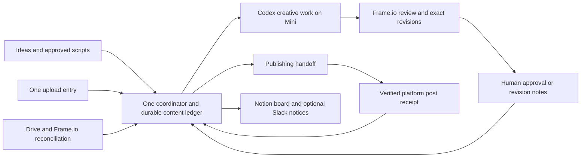

> Updated: the VM archive has now been retrieved and fully checksum-verified. Read [VM-EVIDENCE-AUDIT.md](VM-EVIDENCE-AUDIT.md) for the actual VM findings and corrections. The SSH blocker and VM-unverified statements below are historical.

# Mansoor workflow audit — working evidence, September 15, 2026

This is an ongoing audit, not a claim that every file or live system has been inspected. No production automation, Slack reactions, Notion statuses, or Drive organization has been changed by this audit.

## Intended outcome

Mansoor supplies ideas, recordings, and approvals; Ivan controls strategy and quality. The system should reliably turn that input into correctly identified, edited, reviewed, and published content without Ivan maintaining the same facts in several apps. A human should only need to make decisions that require judgment, resolve ambiguous footage, and review creative work.

The original business context prioritizes targeted scripted shorts for two distinct US life-insurance audiences: sales-heavy solo agents and team-heavy operators missing professional sales systems. Broad sales/lifestyle content supports discovery; targeted scripts, lead magnets, VSL and thank-you assets support conversion. Posting volume is a means, not the operating system’s objective. The context spine is historical strategy, not independent verification of its financial claims or current priorities.

## Documented workflow

1. Slack idea arrives. Content Manager captures a Source and Content Object through Content PM.
2. Idea Guy dispatches analysis and script writing to Codex using the applicable playbook.
3. Script appears in the Notion page body. A separate Slack message links to it.
4. Ivan edits the body and approves with a checkmark; brain reaction additionally requests learning. Approval copies the body into the Script property and assigns Mansoor in Film Next.
5. Mansoor records and uploads. The existing sweeper requires a narrowly formatted Slack upload-complete announcement, then delegates classification and filing.
6. Scripted footage is matched to a script; unscripted recordings become Sources with zero or more independently reviewable clip objects. B-roll is reusable source material rather than automatically a deliverable.
7. Master Video Editor dispatches the format-specific editor. The current skills mandate disposable cloud proxies before Mini editing; this reflects the previous storage constraint, not an inherent editorial requirement.
8. Each deliverable has source mappings, an editable project, revisions, QC evidence, and a stable Frame.io review context.
9. Slack checkmark approves a video; memo picks up Frame.io revision notes; X blocks/rejects. Revisions should preserve the original content identity and review history.
10. Ready-to-post organization and scheduling follow. The historical architecture describes the poster as planned/incomplete. Current live publishing automation remains unverified.

Historical state list: Ideas for Review → Approved Ideas → Ready to Script → Script Needs Review ↔ Script Revisions Needed → Ready to Film → Uploaded → Ready to Edit → Edit in Progress → Edit Ready for Review ↔ Edit Revisions Needed → Ready to Post → Scheduled → Posted; BLOCKED may interrupt. Clipping bypasses writing and filming states.

## Verified problems and practical consequences

- **Intake depends on a manual message.** Live Slack search for upload-complete announcements in content-team after September 1 returned matching messages only on September 3. This search is not proof that no other announcement exists, but the configured exact trigger can miss real uploads.
- **Inbox presence does not mean unedited.** The fresh September 15 inbox snapshot contains the five September 10 sources already edited, as well as new footage. Re-running intake without source-ID reconciliation risks duplicate editing.
- **Filming and board status diverged.** The active new-footage task documents four filmed scripts still marked Script Needs Review, in addition to three Ready to Film scripts. Matching only Ready to Film/Uploaded cannot recover all these cases.
- **Sweeper success is under-validated.** In the local `tools/drive-sweeper/sweeper.py`, nonempty final worker text is sufficient for the wrapper’s completion flag. It does not itself prove asset identification, Drive moves, readback, and downstream handoff. Its prompt forbids Notion writes while the skill’s later handoff asks for Source/Object updates.
- **Matching can manufacture confidence.** Local `tools/content-os/pm_repair.py` can substitute a supplied object’s canonical script when no transcript exists, then give high confidence. Filenames also contribute to matching, and required media paths can be empty. This needs evidence-based matching before enabling unattended filing.
- **Several execution layers only return plans.** PM returns Notion/Slack/reaction actions for a coordinator to execute and acknowledge. This is workable only with durable retries and readback; an agent remembering the next handoff is insufficient.
- **Competing state ownership.** Docs call Notion Status authoritative while wrappers also maintain SQLite states, pending actions, session states, and file manifests. There is no verified single live reconciliation loop yet.
- **Documentation conflicts.** SCRIPT_DELIVERY.md still mandates the legacy ai-content-team channel while CONTENT_PM.md and current skill delivery rules use separate script/video review channels. Ready-to-post flags and instructions also conflict. Several documents are drafts or historical partial implementation reports.
- **Host assumptions remain embedded.** Mini copies of primary wrappers contain `/home/box/mansoor-content-operations` roots. The workspace README explicitly identifies the VM as the live source of truth. A copied repository is not proof of a deployed Mini coordinator.
- **Format coverage is incomplete.** The registered short-form types do not explicitly cover VSL, thank-you video, YouTube, and reusable B-roll intake. Missing handlers must surface clearly rather than silently misroute into a short-form editor.

These are findings in inspected local code and evidence. Their presence in the current VM deployment must still be checked.

## Current content reconciliation — partial

| Content | Evidence | Current conclusion |
|---|---|---|
| Why agents go quiet after 30 days | Live Instagram reel DdNWNJTqgd7, headline, page publication time, downloaded audio and fresh Parakeet transcript; matches September 9 Take 0006 script | Posted. Publication timestamp 2026-09-13 01:26:39 UTC. Exact exported revision not established. |
| September 10 Takes 17–21 | Local edit/revision/delivery artifacts; same Drive source IDs still in September 15 inbox | Already edited; individual approval/publication reconciliation pending. |
| “Must be nice” | Headline observed on Instagram DdP4uItq1cC and matching local Take 0019 material | Posted; confirmed by full posted-audio transcription. Exact export revision not established. |
| “Babysitting my team is BORING” | Headline observed on Instagram DdSXu24q6WJ and matching local Take 0020 material | Posted; confirmed by full posted-audio transcription. Exact export revision not established. |
| September 15 intake | Concurrent task STATUS.md and source-ID exclusion manifest | Seven scripted reels plus thank-you footage being handled; avoid duplicate dispatch. Other long-form uploads also need classification. |

A missing post in the inspected subset is **unknown**, not “not posted.” The Instagram match evidence is in `evidence/instagram/`.

## Recommended simpler design — proposal, not deployed

Use one small coordinator service on the Mini and one durable local database with backups. Keep one controlled editorial queue for Mini GPU work. Codex performs script adaptation, ambiguous source classification, take/story selection, editing, and review interpretation. Ordinary code performs listing, IDs, filing, transitions, retries, notifications, and receipts.

Keep existing applications in narrow roles:

- **Frame.io:** active raw footage, review versions/comments, and approved exports; mounted source access on the Mini after a real test.
- **Notion:** human-readable content board and script editor. The coordinator snapshots the approved script version and records later changes explicitly.
- **Drive:** documents, existing library, archive, and legacy intake during migration. Maintain the current single upload entry while it remains in use; do not force two concurrent upload destinations.
- **Slack:** idea input and optional review/notification interface. It must not be the only detector of newly uploaded media or the sole record of approval.

Use stable provider asset IDs, a Content ID, and a Revision ID. Separate a recording from the deliverables made from it. A renamed file is the same source; a revised export is the same content with a new revision; a sales recording can generate many clips; B-roll can support many objects.

Every external side effect gets a durable pending record and an idempotency key. Execute, read back, then mark complete. Restarting must resume incomplete work without duplicating files, jobs, or messages. Periodic reconciliation catches missed events and manual work. A Slack delivery failure should retry delivery without rerendering an approved video.

Intake becomes: detect completed/stable upload → inspect media once → identify/classify → plan destination and associations → file using the same source ID → verify → queue the correct next action. Uncertain associations remain in a visible exception queue. A 100% organized library requires a place for unresolved items; it cannot honestly mean 100% automatic certainty.

Approval binds the exact reviewed export, never just a mutable link. Publication requires an account, platform post ID/URL, timestamp, and content association. A rendered file, a Frame.io upload, a Slack checkmark, and a published post are distinct facts.

The long state list can remain as presentation labels during migration. Internally separate creative stage, automation health, and publication status so a failed API retry does not turn an otherwise finished video into a mysterious BLOCKED item.

Preserve the useful project contract already drafted in MVE_PROJECT_SYSTEM: immutable originals; editable timelines; source mappings; revision identity; QC tied to export hash; independent delivery per reel. Simplify dispatch, not editorial standards.

## Frame.io readiness

The prior Codex discussion correctly identified mounted storage as a possible way to edit cloud originals with the Mini GPU. Official docs confirm on-demand, chunked access through normal filesystem paths. It is not zero local disk usage: accessed data is cached, and reading/transcribing an entire source can still transfer much of it.

Frame.io Drive is installed on the MacBook but was absent on the Mini. No mounted project was found on either host during inspection. Mini free space was approximately 12 GiB. Official pages disagree on a 10 versus 20 GB minimum cache; the setup page asks for 50 GB free SSD. Treat the actual app and a measured pilot as authoritative, and use an adequately sized APFS SSD cache.

Sources: [Frame.io Drive setup](https://help.frame.io/en/articles/14501614-getting-started-with-frame-io-drive-mounted-storage), [cache behavior and configuration](https://help.frame.io/en/articles/14501747-setting-your-cache-size-and-location).

Before replacing the cloud-proxy path: verify the correct Mansoor account/project and entitlement; configure cache; mount one project; open a real original; test seeking, audio sync, edit/export, relink after restart, and cache growth. Existing active edits should finish on their current source mappings. No mass upload, storage purchase, or migration has occurred in this audit.

## Remaining audit and migration work

1. Verify changed Grokbot SSH identity, then read the current deployment, agent instructions, scheduled workflows, state, and active code. The online VM fingerprint differs from both previously trusted Mini/MacBook records; verification is pending.
2. Complete Instagram post/audio/script reconciliation, including remaining September batches and actual review receipts.
3. Inspect live Frame.io account/storage and resolve Mini cache capacity; run the mounted-original pilot.
4. Finish coverage of relevant local/MacBook skills, code, runtime services, and Muse’s actual involvement. Inventory is not read coverage.
5. Build a read-only reconciler first and run it against existing work. Review a concrete per-object correction plan before any broad backfill.
6. Introduce one authoritative coordinator in shadow mode. Prove duplicate-event, restart, partial-failure, manual-upload and manual-post recovery. Then cut over one intake lane and retire its old dispatcher. Do not leave two writers active for the same lane.

A Miro/Lucidchart drawing would be useful for the desired human experience—who uploads, who reviews, and what each person wants to see. It is not required to reconstruct the existing implementation; that map should come from the evidence above.

### Live Frame.io account check

The signed-in browser confirms **Mansoor's Account**, with Ivan as the signed-in member. Its Plan page shows a **Team free trial ending September 19, 2026**, **5 TB total standard storage** and **250 GB total mounted storage during the trial**. The page directs this member to contact an admin for more storage; the available account navigation shows Plan and Labs but no Storage administration page. A subscription or account-admin change has not been made. This is a concrete prerequisite to resolve before relying on Frame.io as the permanent raw-footage home.

### Additional verified findings

- Posted audio now confirms **“Must be nice”** = September 10 Take 0019 and **“Babysitting my team is BORING”** = Take 0020. Fresh ASR agrees closely with local edited speech; exact uploaded revision still needs visual/audio identity verification because multiple revisions share the same words. Their match JSON files record source IDs and local Frame.io receipts.
- The MacBook `mansoor-upload-intake` skill is a separate intake contract: it expects **@ChatGPT**, calls Slack the operational record, and explicitly forbids Notion records. The Mini/Grok sweeper contract expects **@composio** and later describes Notion handoffs. This is concrete cross-host drift, not merely stale status.
- MVE already has a stronger completion gate than the sweeper, so it would be wrong to claim all wrappers accept nonempty text alone. However, isolated read-only reproductions found two weaknesses in its success-layer helper: a generic asset-ID string is accepted as evidence for all claimed layers without a verified receipt; and an old `final-result.json` wrapper envelope is preferred over a newly written `worker-result.json`, producing a false missing-layers block. Evidence: `evidence/mve-gate-reproductions.json`. These tests used temporary files only; the full delivery gate also has other checks.

### Reconciliation artifacts

`content-reconciliation.csv` and `.json` consolidate eight known source records: the five September 10 reels, VSL, and two September 9 reels. Four scripted posts are confirmed by actual posted audio, including **“Sales or recruiting? You need both.”** (September 9 Take 0007). Others remain publication-unknown; do not queue reposts from this partial audit. The small `tools/reconcile_local.py` script regenerates these artifacts from existing receipts and the explicit Instagram evidence without making external changes.

### Proposed flat operating map

This map removes dispatcher personalities from the execution path while preserving the human decisions and creative work they were meant to support.
