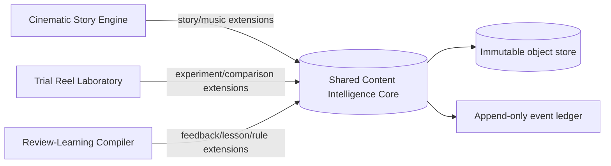

# Mansoor Unified Content Intelligence Core

Status: alignment design; not an implementation and not a finalized skill  
Date: 2026-09-09

This design aligns the Cinematic Story Engine (CSE), Trial Reel Laboratory (TRL), and Review-Learning Compiler (RLC) around one canonical PostgreSQL database and one immutable, content-addressed evidence store.

## Governing invariant

There is one identity and lineage spine:

`idea → creative family → hypothesis/treatment → version → exact change → render → publication → performance → review/feedback → conclusion → lesson candidate → promoted rule`

The modules add specialized records around this spine. They do not create parallel assets, audio, versions, manifests, renders, publications, reviews, or performance snapshots.



## 1. Unified schema and ownership

Use four PostgreSQL schemas: `content_core`, `cinematic`, `trial_lab`, and `review_learning`. Cross-schema foreign keys are mandatory. A text field that merely resembles a shared ID is not an acceptable relationship.

### 1.1 Shared Content Intelligence Core

These tables are canonical. Every module reads or references them.

| Table | Canonical responsibility |
| --- | --- |
| `content_core.ideas` | Content opportunity or concept intake |
| `content_core.creative_families` | Stable mechanism/template family |
| `content_core.family_seed_specs` | Immutable parent for a family's first real version |
| `content_core.versions` | Immutable complete creative specification and parent |
| `content_core.version_change_sets` | Declared variable, parent/child hashes, exact diff and constant-check result |
| `content_core.version_change_items` | Field-level before/after values and intended-variable flag |
| `content_core.version_constant_assertions` | Positive machine proof of what remained fixed |
| `content_core.source_assets` | Canonical media/file identity, hash, probe, rights and privacy state |
| `content_core.asset_aliases` | Drive IDs, filenames, legacy paths and provider-native IDs |
| `content_core.asset_segments` | Exact in/out range, identity, privacy, era and story role |
| `content_core.audio_assets` | Voice, music, SFX and natural-sound identities |
| `content_core.audio_rights_records` | License/ownership scope, proof, terms date and publication coverage |
| `content_core.picture_manifests` | Immutable ordered picture edit |
| `content_core.picture_manifest_items` | Asset segment, source/timeline range, crop, speed, grade and transition |
| `content_core.copy_manifests` | Immutable caption and on-screen-copy package |
| `content_core.copy_cues` | Exact text, timing, geometry, style and safe-zone result |
| `content_core.audio_manifests` | Immutable resolved voice/music/SFX/natural-sound mix inputs |
| `content_core.audio_manifest_items` | Audio asset, source/timeline range, gain/fades, bus and role |
| `content_core.export_presets` | Immutable container/codec/dimensions/frame-rate/loudness configuration |
| `content_core.renders` | Every render execution and output identity |
| `content_core.render_artifacts` | MP4/master/contact sheet/transcript/manifest/probe artifacts |
| `content_core.qc_checks` | Machine/human technical, privacy, identity, rights and content gates |
| `content_core.publications` | Deployment of exactly one render to one platform/account |
| `content_core.publication_aliases` | Instagram media ID, shortcode and permalink |
| `content_core.publication_state_events` | Trial-only, shared-to-everyone, pulled, deleted and other transitions |
| `content_core.metric_registry` | Stable metric name, semantics, unit, direction and platform availability |
| `content_core.performance_snapshots` | Timestamped observation of one Mansoor publication |
| `content_core.performance_metric_values` | Numeric value or explicit unavailable/error status |
| `content_core.source_observations` | Physically separate source/reference-post observations |
| `content_core.source_observation_metrics` | Source metrics; excluded from Trial views by schema/query contract |
| `content_core.distribution_contexts` | Trial/follower exposure, paid, collab, crosspost, time band and account state |
| `content_core.reviews` | Explicit typed human or machine decision |
| `content_core.review_subjects` | Constrained link from a review to version/render/publication/conclusion/rule |
| `content_core.operational_incidents` | Freeze, bad audio, privacy, duplicate, leak, missed window or mismatch |
| `content_core.external_aliases` | Slack, Notion, Asana, Frame, Drive and other external identity mapping |
| `content_core.actors` | People/services, roles and authority domains |
| `content_core.object_blobs` | Content-addressed evidence and file descriptors |
| `content_core.domain_events` | Append-only, hash-chained business event ledger |
| `content_core.idempotency_keys` | Retry/duplicate prevention for commands and ingestion |

Core rules:

1. A version references exactly one immutable picture, copy, audio and export specification.
2. Every render receives a permanent render ID and a resolved, self-contained manifest. It never points only to a mutable Drive filename.
3. `content_core.publications` is the only publication table. Trial status is a state event, not a second publication type.
4. `content_core.performance_snapshots` is the only Mansoor-publication snapshot table. Source performance lives in separate physical tables and cannot enter Trial baselines by default.
5. `content_core.reviews` is the only review/decision table. RLC evidence may be cited by a review but does not duplicate it.
6. Current statuses are rebuildable views over events and canonical rows, not fields that overwrite history.

### 1.2 Cinematic Story Engine module

| Table | Module responsibility | Shared foreign key |
| --- | --- | --- |
| `cinematic.story_treatments` | Origin, Legacy or Freedom treatment and one-sentence story | family |
| `cinematic.story_spines` | Identity → tension → effort → transformation → meaning | treatment |
| `cinematic.story_beats` | Beat timing, narrative role and intended emotion | treatment; asset segment optional |
| `cinematic.claims` | Exact factual, relationship or autobiographical claim | family/version |
| `cinematic.claim_evidence` | Verification/approval evidence for a claim | claim, core blob |
| `cinematic.music_treatments` | Custom score treatment and its creative brief | version, audio manifest |
| `cinematic.musical_beats` | Cold open, tension, escalation, turn, lift, payoff and ending | music treatment |
| `cinematic.sound_cues` | Narrative intention for SFX/natural-sound cues | version, core audio item |
| `cinematic.narrative_qc_results` | Causal spine, comprehension, specificity and payoff-meaning result | render/review |
| `cinematic.missing_footage_requests` | Needed story receipt absent from the asset library | treatment |

The authoritative timeline remains the Core picture/audio manifests. Cinematic beat records explain intent; they do not repeat the authoritative media edit.

### 1.3 Trial Reel Laboratory module

| Table | Module responsibility | Shared foreign key |
| --- | --- | --- |
| `trial_lab.hypotheses` | Falsifiable statement, mechanism, primary/fallback/guardrail metrics | family, metric registry |
| `trial_lab.experiments` | Pre-registered controlled test and control | family, hypothesis, version |
| `trial_lab.experiment_arms` | Control/treatment allocation | experiment, version, publication optional |
| `trial_lab.distribution_protocols` | Trial mode, posting band, spacing, auto-share/paid/crosspost rules | experiment |
| `trial_lab.snapshot_schedules` | 1h/6h/24h/72h/7d due times and tolerances | publication |
| `trial_lab.baseline_definitions` | Reproducible account/family comparison membership rules | family/account/metrics |
| `trial_lab.baseline_members` | Frozen publications/snapshots used in a baseline | core snapshot |
| `trial_lab.baseline_statistics` | Median/MAD/percentiles by metric/window/context | baseline |
| `trial_lab.comparison_results` | Control/account/family/age/distribution comparison | core snapshot |
| `trial_lab.decision_rules` | Versioned winner/loser/inconclusive thresholds | experiment |
| `trial_lab.conclusions` | Human-approved arm/test result | experiment, version, review |
| `trial_lab.follow_up_experiments` | Next test attached to the producing conclusion | conclusion/next experiment |

TRL schedules and analyzes Core snapshots. It never creates `trial_lab.performance_snapshots`.

### 1.4 Review-Learning Compiler module

| Table | Module responsibility | Shared foreign key |
| --- | --- | --- |
| `review_learning.source_captures` | Immutable Slack/Codex/Asana/Frame/Markdown/manual payload | core blob/actor |
| `review_learning.feedback_evidence` | Verbatim span, timecode/frame and canonical subject | version/render/publication/review |
| `review_learning.feedback_interpretations` | Versioned inferred request/reason, separate from quote | feedback |
| `review_learning.evidence_origin_groups` | Prevent copied evidence counting as independent repetition | capture/feedback |
| `review_learning.feedback_edges` | Supports, contradicts, implements, duplicates or supersedes | feedback/lesson |
| `review_learning.revision_actions` | What changed because of feedback | before/after shared version/render |
| `review_learning.lesson_candidates` | Scoped, testable institutional-memory candidate | family/workflow/metric scope |
| `review_learning.lesson_evidence` | Feedback/review/QC/experiment/conclusion/performance support | lesson + canonical entity |
| `review_learning.conflict_clusters` | Opposing claims and context matrix | feedback/lessons |
| `review_learning.rule_change_proposals` | Proposed documentation or preflight diff | lesson |
| `review_learning.promoted_rules` | Approved rule identity and representation | lesson, approving core review |
| `review_learning.rule_status_events` | Promoted/narrowed/superseded/deprecated/retired | rule |
| `review_learning.document_projections` | Hash/version of generated digest/playbook projection | rule/lesson set |

RLC cannot mutate shared evidence to make a lesson stronger. It can append interpretations, evidence edges and proposals. Promotion requires an authorized `content_core.review`.

### Relationship spine

```text
idea ─ family ─ version ─ render ─ publication ─ performance snapshot
          │         │        │          │                 │
          │         └─ shared reviews/feedback evidence ──┘
          ├─ cinematic treatment/story/music records
          ├─ trial hypothesis/experiment/arm/comparison/conclusion
          └─ lesson candidate/evidence/promoted rule
```

## 2. Shared ID contract

Use uppercase type prefix + underscore + 26-character Crockford Base32 ULID.

| Object | Prefix |
| --- | --- |
| Idea / family / version / change | `IDE_`, `FAM_`, `VER_`, `CHG_` |
| Asset / segment / audio | `MED_`, `SEG_`, `AUD_` |
| Picture / copy / audio manifest | `PIC_`, `CPY_`, `AMF_` |
| Render / publication / snapshot | `RND_`, `PUB_`, `SNP_` |
| Review / feedback / lesson / rule | `REV_`, `FBK_`, `LSN_`, `RUL_` |
| Domain event | `EVT_` |

Rules:

1. IDs are allocated once, never recycled and never encode mutable status/headline/“winner.”
2. `V001`, “Pilot A” and filenames are display labels only.
3. Every version has exactly one parent: the first real version points to `family_seed_specs`; later versions point to a version.
4. External IDs are aliases, never primary keys.
5. Hashes identify equal bytes/specifications but do not replace lineage IDs. Two render executions get two render IDs even when bytes match.
6. One module cannot mint an alternate ID for a shared entity.
7. Every command carries an idempotency key. Retry returns the original result.
8. Each version has a normalized `spec_sha256` covering resolved picture, copy, audio, export and required module-extension references.

## 3. Event and change-log contract

### Domain event envelope

`content_core.domain_events` is append-only and contains:

- `event_id`, `aggregate_type`, `aggregate_id`, `aggregate_sequence`;
- `event_type`, `occurred_at`, `recorded_at`, `actor_id`;
- `correlation_id`, optional `causation_event_id`, `idempotency_key`;
- `reason`, structured `payload`;
- `previous_event_hash`, `event_hash`.

Unique constraints apply to aggregate sequence and idempotency key. Required events include `family.created`, `version.created`, `version.diff_verified`, `render.completed`, `render.qc_passed`, `publication.recorded`, `publication.shared_to_everyone`, `snapshot.capture_attempted`, `snapshot.accepted`, `review.recorded`, `feedback.captured`, `experiment.preregistered`, `experiment.concluded`, `lesson.candidate_created`, `rule.proposed`, `rule.promoted`, `rule.superseded`, `incident.opened`, and `incident.resolved`.

### Version change set

For the first Cinematic Story Engine pilot, keep one version manifest containing the approved picture ranges, copy cues, score, natural sound, SFX, color treatment, duration and export specification. A new version is created only when the creative itself is revised.

### Review, feedback and correction

- A Core review is a typed decision: approve, reject, request changes, hold, validate data or approve rule.
- RLC capture holds exact raw bytes; feedback holds a verbatim span; interpretation is separate and versioned.
- Free text is not approval until recorded as a typed review by an authorized human/adapter.
- A Slack comment copied into Markdown and Codex remains one evidence-origin group.
- Corrections append a superseding row with reason and actor. Default views may show latest accepted state; audit views show the full chain.

## 4. Example Cinematic Origin pilot

All canonical IDs below are illustrative. Existing Drive IDs are real catalog aliases. Exact source ranges must be probed before accepted database rows are created.

### Production definition

| Field | Value |
| --- | --- |
| Creative family | One Origin family: constrained beginning → work → authority → time choice |
| Runtime | 23.5 seconds |
| Audience | Lone Wolf |
| Audio mode | One custom instrumental + natural sound/SFX + minimal copy; no narration |
| Creative objective | Make the causal movement from constrained beginning to work, authority and time choice emotionally legible |
| Review | Internal story, identity, privacy, music and final-render approval |
| Learning | Observe response after publication without treating this pilot as a formal comparison |

### Locked picture and copy

| Time | Role | Drive alias | Picture | Copy |
| --- | --- | --- | --- | --- |
| 0.0–2.2 | identity | Prius `1YKSnw3c2FoCugtaIcpsMhXvXBFeBITwP` | Face-first Mansoor driving | `Before the authority—` |
| 2.2–5.0 | tension | sparse room `10qjRXRyy5Q-Ip8B3CWEHiSkYqhPP4xLY` | Restrained treatment; no unverified homeless claim | `there was a smaller room.` |
| 5.0–8.5 | work | conference `1FxKZBcwHar2JYixk0WP6qPjaoW_8684F` | Mansoor visibly working | `Then: the work.` |
| 8.5–12.0 | work | Zoom `1Bf63DpE9OGxaGNAU8oXH6RSE9mLxNaHI` | Private repetition | — |
| 12.0–15.5 | transformation | whiteboard `1felbzTanbzlSQ_-cX3jz-Xxdcy4g-Hs2` | Private effort becomes teaching | `Repeated until it became value.` |
| 15.5–18.8 | proof | podium `1U0bZ4tdXck2KSfaGTYDNjJNXm7Itusar` | Authority; no audience-size claim | — |
| 18.8–22.0 | reflection | ocean `1yik5nWfwy2EnlGUwEDjBUvvkW-m6iFeA` | Calm choice, not luxury flex | `It created room to choose.` |

Shared locked records:

- one `PIC_` manifest with exact source and timeline ranges;
- one `CPY_` manifest with exact copy cues;
- one locked SFX/natural-sound bus with Prius cabin, restrained room tone, work/keyboard, marker, podium ambience and surf;
- one 22,000 ms duration;
- one 1080×1920/30fps H.264/AAC-LC export preset;
- one pre-registered music loudness and true-peak target window.

### Two shared-core versions

| Field | A | B |
| --- | --- | --- |
| Version identity | one permanent `VER_` | a different permanent `VER_` |
| Parent | family seed | Version A |
| Music source class | `original_custom` | `licensed_library` |
| Music identity | unique `AUD_` + provenance/rights | unique `AUD_` + certificate/terms/license scope |
| Picture/copy/SFX/duration/export | locked shared hashes | same locked shared hashes |
| Declared variable | music source class and track | music source class and track |

Track-specific musical content is necessarily part of the declared variable. Picture cuts do not chase different beats. Each music asset is conformed to the fixed 22-second cue map without changing picture, copy or SFX.

Each version gets a unique render, Trial publication, and five canonical snapshots:

```text
VER_A → RND_A → PUB_A → SNP_A_1H/6H/24H/72H/7D
VER_B → RND_B → PUB_B → SNP_B_1H/6H/24H/72H/7D
```

Core reviews and RLC feedback point to these exact IDs. TRL creates the conclusion. RLC may create the scoped candidate “licensed-library music improved this Origin treatment under the locked 22-second cue map,” but cannot promote a universal music rule from one pilot.

Illustrative canonical row map:

| Row | Permanent ID | Owned by | Links |
| --- | --- | --- | --- |
| Origin family | `FAM_01ARZ3NDEKTSV4RRFFQ69G5FAV` | Core | idea, seed, treatment, versions |
| Cinematic treatment | `CST_01ARZ3NDEKTSV4RRFFQ69G5FAW` | CSE | family, story spine |
| Music hypothesis | `HYP_01ARZ3NDEKTSV4RRFFQ69G5FAX` | TRL | family, metrics |
| Experiment | `EXP_01ARZ3NDEKTSV4RRFFQ69G5FAY` | TRL | hypothesis, protocol, arms |
| Version A | `VER_01ARZ3NDEKTSV4RRFFQ69G5FAZ` | Core | family seed, shared manifests, custom music |
| Version B | `VER_01ARZ3NDEKTSV4RRFFQ69G5FB0` | Core | parent Version A, shared manifests, licensed music |
| A/B change set | `CHG_01ARZ3NDEKTSV4RRFFQ69G5FB1` | Core | Version B, Version A hashes |
| Render A/B | `RND_…FB2`, `RND_…FB3` | Core | exact version + resolved manifest |
| Publication A/B | `PUB_…FB4`, `PUB_…FB5` | Core | exact render + Instagram alias |
| Five snapshots per arm | ten distinct `SNP_` IDs | Core | publication + target/actual age |
| Blind review | one or more `REV_` IDs | Core | render/version subject + feedback evidence |
| Raw feedback | `FBK_…` | RLC | capture + exact reviewed Core subject |
| Conclusion | `CON_…` | TRL | experiment, arm/version, approving review |
| Lesson candidate | `LSN_…` | RLC | conclusion, reviews, feedback and snapshots |

Ellipsized IDs above are display abbreviations only; stored values always contain the full prefix and 26-character ULID.

### Future opening-frame tests

Every opening-frame experiment must store `face_first_policy_relation`:

- `complies`: every arm shows Mansoor's recognizable face within the approved 1–3 second window; only the face-first context changes.
- `challenges`: an arm deliberately omits or delays his face. This needs explicit pre-publication owner approval and a risk rationale.
- `not_applicable`: only when the active rule's approved scope does not apply.

A challenge does not silently weaken the current rule. It creates evidence for later human review.

## 5. Minimum viable manual workflow

1. Register idea, Origin family, treatment, hypothesis, distribution protocol, metrics and decision rule.
2. Resolve Drive aliases to shared asset IDs; hash/probe originals and approve exact segments, identities, privacy and claims.
3. Lock one picture manifest, copy manifest, SFX/natural bus and export preset.
4. Register both music assets and attach original provenance or licensed-track proof/scope.
5. Create A from the family seed; create B from A; freeze both specs.
6. Run normalized diff. Stop unless only declared music fields differ.
7. Render separately under unique IDs; store resolved manifests, hashes, probes and QC evidence.
8. Conduct blind side-by-side narrative/music review. Store typed reviews and raw feedback evidence.
9. An authorized human publishes each Trial Reel using a one-time receipt and records media ID/shortcode, exact time, Trial state and auto-share setting.
10. At 1h, 6h, 24h, 72h and 7d, take full owner-insights screenshots and enter each metric as measured or explicitly unavailable/error. Preserve actual age and distribution state.
11. Freeze comparable baselines, calculate rates and obtain a human winner/loser/inconclusive conclusion.
12. Link reviews, feedback, QC, snapshots and conclusion to lesson candidates. Promote no permanent rule from this single pilot.

Minimum interfaces: one registration form/CLI, one diff/QC view, one publication-receipt form, one mobile snapshot form with screenshot upload, and one conclusion/lesson report. No broad dashboard or connector automation is needed yet.

## 6. Actual Instagram access-validation checklist

This validates Mansoor's authorized account instead of assuming API or UI coverage.

### Account and authorization

- [ ] Confirm and record professional Creator/Business account ID, handle and account type.
- [ ] Name the owner who can authorize the Meta app.
- [ ] Select Instagram Login or Facebook Login and record the required linkage/permissions.
- [ ] Store tokens in Keychain/secret manager outside the repository; record expiry/refresh without token values.
- [ ] Record app ID, API version, permission grant time, test account and access level/app-review requirement.

### Official API identity

- [ ] Fetch authorized account identity and save a sanitized raw response/hash.
- [ ] List recent owned media with IDs, type/product type, timestamps and permalink/shortcode where permitted.
- [ ] Match at least three ordinary Reels to visible Instagram identities.
- [ ] Verify pagination; test inaccessible/nonexistent media error semantics.
- [ ] Publish nothing during validation.

### Official API insights

- [ ] On one ordinary owned Reel, request candidate metrics individually before batching: views, reach, likes, comments, saved, shares, total interactions, average/total Reel watch time, profile visits/follows where supported, and any current retention/skip metric.
- [ ] Distinguish measured zero, empty dataset, unsupported metric, not applicable, permission error and collection failure error.
- [ ] Verify units and definitions from returned metadata/current documentation.
- [ ] Check deprecation/replacement of old play and replay fields for the selected API version.
- [ ] Compare API and owner UI at the same observed time; preserve requests, sanitized payloads, timestamps and hashes.

### Trial Reel discovery

- [ ] On mobile, locate one existing Trial Reel and record Trial label, owner-only location, time and share-to-everyone state.
- [ ] Match it to an API media ID using timestamp, image/content, caption and permalink/shortcode if exposed.
- [ ] Determine whether it appears in the official media list before wider sharing.
- [ ] Determine whether the API returns a Trial-specific flag or only a normal media object.
- [ ] Request insights for that exact object and record which metrics succeed.
- [ ] Test a share-to-everyone transition only on a separately authorized post; record the exact transition time.
- [ ] If no stable API identity exists, document mobile/manual matching as required rather than guessing.

### Owner UI and exports

- [ ] Inventory exact mobile labels for views, likes, comments, shares and any reach, retention/watch, replays, saves, sends, profile visits, follows and distribution fields.
- [ ] Determine whether shares include sends; never infer.
- [ ] Record app/OS version, locale, timezone and screenshot time.
- [ ] Check availability before approximately 24h; unavailable early metrics remain unavailable, not zero.
- [ ] Repeat the inventory on authenticated desktop and determine whether desktop exposes a Trial inventory.
- [ ] Check eligible Meta tools for per-media CSV; preserve/hash an export and determine Trial inclusion, time basis, timezone and refresh delay.

### Exit report

Produce a matrix with `metric/state × API/mobile/desktop/CSV`, selected source, known latency and notes. Exit only when one ordinary Reel and one Trial Reel have stable Core publication identities—or the Trial identity limitation is explicit—and every desired metric has a working source or explicit unavailable state. No credentials may be stored in the repository and no state-changing action may occur without separate authorization.

Meta publicly describes Trial Reels as initially distributed to non-followers, with owner metrics approximately 24 hours later and optional wider sharing based on the first 72 hours. Official professional-account API insights do not by themselves prove Trial-specific inventory/state or parity with the mobile owner UI; account validation is required.

## 7. Smallest usable implementation

### Slice 0 — freeze the contract

- Approve this ownership map, prefixes, enums, metric semantics, unavailable states and event envelope.
- Approve the 23.5-second Origin story, footage, copy, musical beat sheet and review protocol.
- Name database/evidence owners and the Instagram validator.

Acceptance: two people can represent the pilot without duplicating entities or interpreting the approved creative differently.

### Slice 1 — PostgreSQL pilot schema

Implement only the tables needed by the pilot across the four schemas: shared identity/manifests/renders/publications/snapshots/reviews/events; CSE treatment/beats/music; and RLC capture/feedback/interpretation/lesson/evidence. Trial Laboratory comparison tables are not required for this pilot.

Use migrations, foreign keys, CHECK constraints, unique external identity keys, UTC timestamps, append-only triggers/roles, content-addressed files, backups and a restore test.

Acceptance tests:

- updating a frozen version fails;
- a version without exactly one valid parent fails;
- B fails if anything except registered music fields differs from A;
- two render attempts get distinct IDs;
- duplicate Instagram media IDs fail;
- unavailable metric cannot carry numeric zero, while available zero must carry zero;
- source metrics cannot enter Trial baseline queries;
- current-state projections rebuild from canonical rows/events.

### Slice 2 — manual operator surface

Build a small local form/CLI for asset verification, manifest lock, A/B diff, render/QC registration, publication receipt, snapshot+screenshot entry, review, conclusion and lesson-candidate creation.

Acceptance: the whole pilot can be entered/exported without direct SQL edits.

### Slice 3 — access validation

Run the Instagram checklist and store sanitized evidence/capability results. Configure metric forms only from proven availability.

### Slice 4 — execute one pilot

Verify exact source ranges, register music rights, produce A/B, run blind review, publish under the balanced protocol, capture five windows and conclude at 7d.

Acceptance: one query/export traverses family → versions → changes → manifests → renders → publications → snapshots → reviews → conclusion → lesson candidate with no duplicate canonical entity.

Deferred: automated publishing, unattended browser/mobile automation, historical migration, Notion/Slack/Asana sync, automatic rule promotion/document edits, full dashboards and skill packaging.

## Decisions required before coding

1. Original/custom source: human-composed, internally produced, or approved AI-assisted with provenance.
2. Licensed-library provider/plan and legal licensee/end-client.
3. Approve 22 seconds as the locked duration.
4. Approve average-watch ratio as primary and the fallback if unavailable.
5. Approve blind-review rubric and narrative/rights/publication approvers.
6. Set A/B order, separation and comparable posting bands.
7. Choose PostgreSQL host/backup and evidence retention/access policy.
8. Name the authorized mobile/API validator.

## First-party Instagram references

- [Meta: Trial Reels](https://about.fb.com/news/2024/12/trial-reels-try-content-non-followers-first-see-what-perfoms-best/)
- [Meta Instagram API: Insights](https://www.postman.com/meta/instagram/folder/23987686-f659d7d1-d74c-44e4-9192-9b1e8694c511)
- [Meta Instagram API: media insights request](https://www.postman.com/meta/instagram/documentation/6yqw8pt/instagram-api?entity=request-23987686-1ff01566-3509-48bd-a0f4-8571a91ccfdf)
