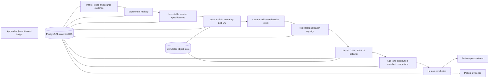

# Mansoor Trial Reel Laboratory — system design

Status: design proposal, not an implementation and not a finalized skill  
Prepared: 2026-09-09  
Core objective: preserve experimental memory so the operation can learn which individual creative decisions reliably improve performance.

> Alignment note: [`../UNIFIED_CONTENT_INTELLIGENCE_CORE_DESIGN.md`](../UNIFIED_CONTENT_INTELLIGENCE_CORE_DESIGN.md) is the controlling shared-core design. It supersedes this document's standalone ownership model and opening-visual-first pilot. The laboratory is a module over the one canonical PostgreSQL database, and the first pilot is the locked 20–25 second Cinematic Origin music-source A/B test.

## Executive decision

The laboratory's system of record should be a relational database with append-only history, backed by immutable/content-addressed files. It should not be a Notion workflow with a few extra properties, a folder of renders, or a dashboard that happens to retain recent results.

The canonical lineage is:

`Idea → Creative family → Hypothesis → Experiment/control → Version → Exact change → Render → Trial Reel publication → Performance windows → Conclusion → Follow-up experiment`

Three architectural rules follow:

1. A **version** is an immutable creative specification. Changing any creative input creates a new version ID.
2. A **render** is an immutable compiled artifact of exactly one version. Re-rendering creates a new render ID even when the version is unchanged.
3. A **publication** is an immutable deployment of exactly one render. Reposting or sharing a trial with everyone creates a new publication/deployment event; it does not mutate historical trial evidence.

Notion, Slack, Drive, and a web dashboard can be interfaces. PostgreSQL is the authoritative memory. Object storage holds manifests, source evidence, screenshots, raw API responses, and render bytes. Every important object is hashed.

The source documents support this direction. They show valuable creative knowledge—face-first openings, origin receipts, real work proof, family payoff, privacy-safe ranges, clean audio, no frozen padding, and asset-fatigue controls—but also show why file names and workflow statuses cannot be the lineage system: multiple items were called “v2,” pulled items were later reposted, and some Drive files were overwritten with new bytes.

## 1. System architecture



### Components

| Component | Responsibility |
| --- | --- |
| Canonical PostgreSQL database | IDs, relationships, experiment state, manifests, observations, comparisons, conclusions, patterns, incidents, and idempotency keys |
| Immutable object store | Source files, render files, screenshots, OCR evidence, CSV files, raw API payloads, contact sheets, transcripts, and signed manifests |
| Experiment registry | Pre-registers control, treatments, hypothesis, changed variable, constants, primary metric, guardrails, minimum evidence, and decision thresholds |
| Version compiler | Converts a version specification into a normalized manifest and content digest; rejects incomplete or ambiguous specs |
| Render worker | Produces a render without changing the version; writes technical probe/QC evidence and SHA-256 |
| Publication adapter | Records an Instagram media ID/shortcode/URL and exact render; publishing remains a separately authorized action |
| Snapshot scheduler | Creates due jobs for 1h, 6h, 24h, 72h, and 7d and records attempts even when metrics are unavailable |
| Collection adapters | Official Instagram API, authenticated owner web/mobile capture, CSV import, screenshot/OCR, and manual entry |
| Comparison service | Computes rates and age/distribution-matched comparisons without mixing source-post evidence with Trial Reel evidence |
| Review interface | Lets humans approve creative/QC, validate collected numbers, conclude tests, and choose follow-ups |
| Audit ledger | Hash-chained, append-only record of every create, supersede, state transition, correction, collection, and conclusion event |

### Authority boundaries

- The database is canonical for identities and lineage.
- The object store is canonical for bytes and evidence.
- Instagram is canonical for publication identity and owner metrics at the moment observed.
- A screenshot or raw response is evidence, not the canonical experiment record until ingested.
- Slack reactions/comments are review inputs, not approval state until a typed review event is recorded.
- Notion may mirror selected records but must never allocate laboratory IDs or overwrite canonical fields.

## 2. Database schema and relationships

Use UTC for stored timestamps and retain `observed_timezone` for manually read displays. Use `jsonb` only for raw payloads and vendor-specific extras; do not hide core relationships or metrics in blobs.

### A. Ideation and experimental design

#### `ideas`

- `idea_id` PK (`IDE_...`)
- `created_at`, `created_by`
- `title`, `problem_or_opportunity`, `creative_intent`
- `source_lane` (`owned_winner`, `trial_learning`, `external_reference`, `human_idea`, `review_learning`)
- `source_reference_id` nullable
- `target_icp` (`recruiter`, `lone_wolf`, or another explicitly defined segment; never silently blended)
- `status`

#### `creative_families`

- `family_id` PK (`FAM_...`)
- `idea_id` FK
- `family_name`, `family_definition`, `causal_mechanism`
- `template_signature`
- `seed_spec_id` FK to `family_seed_specs`
- `created_at`, `retired_at` nullable
- `status` (`active`, `paused`, `retired`)

#### `family_seed_specs`

An immutable pre-version parent so even the first testable version has a required parent reference.

- `seed_spec_id` PK (`SED_...`)
- `family_id` UNIQUE FK
- `spec_json`, `spec_sha256`, `created_at`, `created_by`

#### `hypotheses`

- `hypothesis_id` PK (`HYP_...`)
- `family_id` FK
- `statement` in falsifiable form
- `mechanism`
- `changed_variable_type`
- `primary_metric_id` FK
- `secondary_metric_ids`
- `guardrail_metric_ids`
- `minimum_effect_pct`, `minimum_reach`
- `required_windows`
- `comparison_population_definition`
- `created_at`, `status`

#### `experiments`

- `experiment_id` PK (`EXP_...`)
- `hypothesis_id` FK
- `family_id` FK
- `control_version_id` FK
- `design_type` (`single_variable_parallel`, `sequential`, `factorial`, `observational`)
- `pre_registered_at`
- `planned_start_at`, `planned_end_at`
- `distribution_protocol_id` FK
- `decision_rule_id` FK
- `status`

#### `experiment_arms`

- `experiment_arm_id` PK
- `experiment_id` FK
- `version_id` FK
- `role` (`control`, `treatment`)
- `allocation_order`, `planned_publish_slot`
- UNIQUE (`experiment_id`, `version_id`)

#### `distribution_protocols`

- `distribution_protocol_id` PK
- `mode` (`trial_nonfollowers`, `shared_to_everyone`, other)
- `posting_time_band`, `weekday_policy`, `spacing_hours`
- `auto_share_enabled` boolean
- `collab_policy`, `paid_support_policy`, `crosspost_policy`
- `caption_cta_policy`, `account_state_requirements`
- `notes`, `created_at`

### B. Versions and exact changes

#### `versions`

- `version_id` PK (`VER_...`), permanent
- `family_id` FK
- `display_ordinal` (human label such as `V003`, never used as identity)
- `parent_type` CHECK (`family_seed`, `version`)
- `parent_seed_spec_id` nullable FK
- `parent_version_id` nullable self-FK
- CHECK exactly one parent is populated and matches `parent_type`
- `hypothesis_id` FK
- `created_at`, `created_by`
- `headline_text`
- `first_frame_description`
- `source_audio_id` FK
- `music_audio_id` FK nullable
- `copy_manifest_id` FK
- `broll_manifest_id` FK
- `duration_ms`
- `export_preset_id` FK
- `spec_sha256` UNIQUE
- `superseded_by_version_id` nullable FK
- `is_frozen` true after creation

The table is insert-only except for append-safe lifecycle pointers maintained by a restricted service role. Creative fields cannot be updated. A trigger rejects mutation after freeze. Reviewer and publication status are exposed through a `version_current_state` view derived from append-only `version_status_events`, reviews, renders, and publications; they are never mutable creative-version columns.

#### `version_change_sets`

- `change_set_id` PK (`CHG_...`)
- `version_id` UNIQUE FK
- `parent_spec_sha256`
- `child_spec_sha256`
- `declared_variable`
- `change_summary`
- `changed_field_count`
- `constant_assertion_status` (`pending`, `pass`, `fail`)
- `created_at`, `created_by`

#### `version_change_items`

- `change_item_id` PK
- `change_set_id` FK
- `field_path` (for example `broll.slots[0].source_segment_id`)
- `before_value`, `after_value`
- `change_reason`
- `is_intended_variable` boolean

#### `version_constant_assertions`

- `constant_assertion_id` PK
- `change_set_id` FK
- `field_path`
- `expected_value_or_hash`
- `actual_value_or_hash`
- `status` (`same`, `different`, `not_comparable`)
- `checked_at`, `checker_version`

An experiment arm cannot be published when undeclared differences exist. If multiple variables truly must change, mark the design `confounded`; it may generate a directional observation but cannot establish a causal winner.

### C. Media, audio, copy, and manifests

#### `source_media`

- `source_media_id` PK (`MED_...`)
- `external_provider`, `external_file_id`, `canonical_uri`
- `original_filename`, `media_type`
- `byte_sha256`, `perceptual_hash`
- `duration_ms`, `width`, `height`, `frame_rate`, `codec`
- `captured_at`, `ingested_at`
- `rights_status`, `privacy_status`
- `people_tags`, `story_roles`, `emotion_tags`, `era_tag`
- `favorite_tier`, `motion_quality`, `face_first_safe`
- UNIQUE (`external_provider`, `external_file_id`)
- UNIQUE (`byte_sha256`)

#### `source_media_segments`

- `source_segment_id` PK (`SEG_...`)
- `source_media_id` FK
- `in_ms`, `out_ms`
- `wife_face_safety` (`safe`, `unsafe`, `unknown`)
- `identity_validation` (`mansoor`, `dad`, `other`, `none`, `unknown`)
- `story_role`, `notes`
- `segment_sha256` or deterministic segment fingerprint

This is where exact safe ranges live. Asset-level “wife safe” is insufficient when one file contains safe and prohibited frames.

#### `audio_assets`

- `audio_id` PK (`AUD_...`)
- `kind` (`voiceover`, `instagram_audio`, `licensed_music`, `generated_score`, `natural_sound`, `mix`)
- `external_audio_id` nullable (stable Instagram audio ID when applicable)
- `source_media_id` nullable FK
- `title`, `creator_or_speaker`
- `rights_status`, `license_evidence_object_key`
- `transcript`, `transcript_sha256`
- `clean_or_profane`, `quality_grade`
- `duration_ms`, `loudness_lufs`, `codec`, `bitrate`
- `byte_sha256`

#### `copy_manifests` and `copy_cues`

The manifest stores caption, on-screen text, CTA, font identity, geometry, animation, and timing. Each cue has exact text, start/end milliseconds, bounds, safe-zone result, and style hash.

#### `broll_manifests` and `broll_manifest_items`

- manifest: `broll_manifest_id`, `manifest_sha256`, `created_at`
- item: `item_id`, `broll_manifest_id`, `sequence_index`, `source_segment_id`, `timeline_in_ms`, `timeline_out_ms`, `crop`, `scale`, `speed`, `color_treatment`, `transition_in`, `transition_out`, `story_role`

Constraints reject overlapping sequence errors, an out-point before an in-point, and prohibited segments. A QC rule detects adjacent or near-repeat assets within the configured cooldown (initially five seconds).

#### `export_presets`

- `export_preset_id`, `name`, `container`, `video_codec`, `audio_codec`
- width/height, frame rate, bitrate/quality, color space, audio sample rate/channels, loudness target
- `preset_sha256`, `created_at`

### D. Renders, QC, reviews, and publications

#### `renders`

- `render_id` PK (`RND_...`)
- `version_id` FK
- `created_at`, `render_worker_version`
- `render_manifest_object_key`, `render_manifest_sha256`
- `media_object_key`, `byte_sha256`
- resolved asset, audio, copy, B-roll, and export-manifest hashes (the render manifest is self-contained even if an upstream interface disappears)
- probed duration/width/height/frame rate/codecs/loudness
- `status` (`rendering`, `complete`, `failed`, `quarantined`)
- `supersedes_render_id` nullable FK

The object key should include the immutable `render_id`, never merely `headline_v2.mp4`. A re-render creates a new row and new object; the old bytes remain addressable.

#### `qc_checks`

- `qc_check_id`, `render_id`, `check_type`, `tool_version`
- `status` (`pass`, `fail`, `warning`, `unavailable`)
- `observed_value`, `threshold`, `evidence_object_key`, `checked_at`

Initial checks: technical probe, full watch attestation, full listen attestation, freeze detection, black/frozen frames, first-face timing, text safety/readability, privacy/wife-face, identity/wrong-Dad, duplicate asset, audio rights, profanity, loudness/quality, unsupported claim, manifest-to-render match.

#### `human_reviews`

- `review_id` PK (`REV_...`)
- `subject_type` (`version`, `render`, `publication`, `snapshot`, `conclusion`)
- typed subject FK through constrained association tables
- `reviewer_id`, `reviewed_at`
- `decision` (`approve`, `request_changes`, `reject`, `hold`, `validate_data`)
- `reason_code`, `verbatim_comment`, `structured_notes`
- `source_system`, `external_event_id`
- `supersedes_review_id` nullable

Reviews are events. A later approval does not erase a prior rejection or revision request.

#### `trial_reel_publications`

- `publication_id` PK (`PUB_...`)
- `render_id` FK
- `experiment_arm_id` FK
- `instagram_media_id`, `instagram_shortcode`, `permalink`
- `published_at`, `publication_mode`
- `trial_status` (`trial_only`, `shared_to_everyone`, `ended`, `deleted`, `unknown`)
- `auto_share_enabled`
- `account_id` FK
- `distribution_context_id` FK
- `external_identity_confidence`
- UNIQUE (`account_id`, `instagram_media_id`)
- UNIQUE (`account_id`, `instagram_shortcode`)

If a Trial Reel is later shared with everyone, preserve a `publication_state_events` row with the transition time. Metrics before and after that transition must be distinguishable because distribution conditions changed.

### E. Performance, comparisons, conclusions, and learning

#### `metric_registry`

- `metric_id`, canonical name, unit, direction (`higher_better`, `lower_better`, `context_only`)
- numerator/denominator definition where applicable
- availability notes by API/UI/version
- deprecation dates and replacement metric

Canonical metrics should include: views, reach, three-second hold count/rate, average watch time, total watch time, completion count/rate, replays, likes, comments, shares, sends, saves, profile visits, follows, total interactions, and all available audience/distribution breakdowns.

#### `trial_performance_snapshots`

- `snapshot_id` PK (`SNP_...`)
- `publication_id` FK
- `target_window` (`1h`, `6h`, `24h`, `72h`, `7d`, optional later windows)
- `scheduled_for`, `captured_at`, `actual_age_seconds`
- `within_window_tolerance` boolean
- `collection_method`, `collection_attempt_id`
- `evidence_object_key`, `raw_payload_sha256`
- `supersedes_snapshot_id` nullable
- UNIQUE partial rule for one active accepted snapshot per (`publication_id`, `target_window`)

#### `trial_snapshot_metric_values`

- `snapshot_id` FK, `metric_id` FK
- `availability_status` (`available`, `unavailable`, `not_applicable`, `hidden_by_platform`, `collection_error`, `pending_validation`)
- `numeric_value` nullable
- `displayed_value_text` nullable
- `provenance_path` (API field, UI label, CSV column, OCR box)
- `confidence` and `validation_status`
- CHECK: `numeric_value` is null unless the status permits a measured value

#### `source_performance_snapshots` and `source_snapshot_metric_values`

These are separate physical tables for external/owned source-post observations. They do **not** FK to Trial Reel publications and cannot be returned by the default Trial Reel analytics view. This makes accidental source/trial aggregation much harder than relying on a label in one metrics table.

#### `distribution_contexts`

- account follower count at publication/snapshot
- trial-only versus shared-to-everyone intervals
- follower/non-follower reach or view share when exposed
- recommendation/source surfaces when exposed
- paid/organic, boost, collaborator, cross-post status
- posting weekday/time band, concurrent-post load, caption/CTA class
- audience geography/demographics when exposed and privacy-safe
- collection notes and availability per field

#### `baseline_definitions`, `baseline_members`, `baseline_statistics`

Keep baselines reproducible rather than storing one mutable “average.” A definition records eligibility filters and lookback window. Membership freezes the exact publications used. Statistics store median, MAD/percentiles, sample size, age window, distribution mode, and calculation version.

Required baseline scopes:

- Mansoor account baseline: recent comparable Trial Reels, normally trailing 30 eligible publications or 90 days.
- Creative-family baseline: prior eligible publications in the same family.
- Control: the experiment's pre-registered control version/publication.
- Age baseline: same target window and actual-age tolerance.
- Distribution baseline: same trial/shared status and comparable follower exposure, paid/collab/crosspost state, time band, and account state.

#### `comparison_results`

- `comparison_id`, `snapshot_id`, `comparison_scope`
- `baseline_definition_id` or `control_snapshot_id`
- metric value, normalized rate, absolute delta, relative lift
- percentile, robust z-score when sample size permits
- comparability score and mismatch reasons
- calculation version, calculated_at

#### `conclusions`

- `conclusion_id` PK (`CON_...`)
- `experiment_id` FK
- `version_id` FK for the evaluated arm
- `status` (`winner`, `loser`, `inconclusive`)
- `conclusion_window`, `primary_metric_result`
- `evidence_summary`, `limitations`
- `decision_rule_id`, `rule_evaluation_json`
- `concluded_at`, `concluded_by`
- `supersedes_conclusion_id` nullable

#### `follow_up_experiments`

- `follow_up_id`, `source_conclusion_id` FK, `next_experiment_id` FK nullable
- `recommended_test`, `rationale`, `priority`, `status`

#### `patterns`, `pattern_evidence`, and `pattern_status_events`

- A pattern has `pattern_id`, definition, variable/mechanism, scope, and current status.
- Evidence links the pattern to the exact conclusion and experiment that produced it.
- Status events append `candidate`, `promoted`, `retired`, or `disproven` with a rule, timestamp, and actor.
- “Promoted patterns” and “retired/disproven patterns” are filtered views, not disconnected notes.

#### `operational_incidents`

- `incident_id` (`INC_...`), severity, stage, detected_at
- `version_id`, `render_id`, `publication_id`, or `snapshot_id` as applicable
- `incident_type` (overwrite attempt, duplicate publish, frozen frame, unsafe face, wrong identity, bad audio, missed window, OCR mismatch, Slack leak, collection failure, manifest mismatch, etc.)
- `description`, `evidence_object_key`, `root_cause`
- `containment`, `resolution`, `resolved_at`
- `caused_data_exclusion` boolean

Creative performance and operational quality are reported separately, then joined for eligibility. A reel may be creatively promising but operationally invalid; the incident remains attached rather than being rewritten as a creative loss.

#### `audit_events`, `collection_attempts`, and `idempotency_keys`

Every mutation emits an audit event with actor, action, target, timestamp, reason, request ID, previous-event hash, and event hash. Every collection attempt is retained, including empty and failed attempts. Idempotency keys prevent retry-created duplicates.

## 3. Version-ID convention

Use prefixed ULIDs (26-character Crockford Base32) as permanent IDs:

- `FAM_01K4Q6KJ7Y8M2P3R4S5T6V7W8X`
- `VER_01K4Q70C4C1S9KQ2H8W6D3M5NP`
- `RND_01K4Q74H91ZP0G6V8A2K3J5M7C`
- `PUB_01K4Q79DV3N8B1T5X6Y7Z9C2KF`

Properties:

- Globally unique without a central sequence bottleneck.
- Sortable by creation time, while `created_at` remains authoritative.
- Never encodes mutable semantics such as headline, status, winner, or filename.
- `V001`, `V002`, and `V003` are display ordinals scoped to a family, not identifiers.
- External IDs (Drive ID, Instagram media ID, shortcode, Slack timestamp, Notion page ID) are aliases in mapping tables, never primary keys.

The first testable version has `parent_type=family_seed`; every later version has `parent_type=version` and a populated `parent_version_id`. Sibling treatment versions can share the same control parent.

## 4. Change-log format

The human-readable change log is generated from normalized machine records:

```yaml
change_set_id: CHG_01K4...
family_id: FAM_01K4...
version_id: VER_01K4...V003
parent:
  type: version
  id: VER_01K4...V001
hypothesis_id: HYP_01K4...
declared_variable: opening_visual
exact_changes:
  - field: broll.slots[0].source_segment_id
    before: SEG_FACE_GREY_000000_001200
    after: SEG_SPARSE_ROOM_000000_001200
  - field: first_frame.description
    before: Mansoor grey-sweatshirt face
    after: Mansoor in sparse room with sleeping bag and chairs
constants:
  - field: headline_text
    value_sha256: 6e5f...
    status: same
  - field: source_audio_id
    value: AUD_01K4...VOICE
    status: same
  - field: music_audio_id
    value: AUD_01K4...SCORE
    status: same
  - field: broll.slots[1:4]
    value_sha256: 3a91...
    status: same
  - field: copy_manifest_id
    value: CPY_01K4...
    status: same
  - field: duration_ms
    value: 12000
    status: same
  - field: export_preset_id
    value: XPT_1080X1920_H264_V1
    status: same
undeclared_differences: []
constant_assertion_status: pass
```

Required format rules:

- Values are normalized before diffing; whitespace, timing, crop, loudness, and export changes count.
- Each change has before, after, field path, reason, and whether it is the intended variable.
- Constants are positive assertions, not prose such as “everything else stayed the same.”
- A machine diff is attached. Human summaries cannot substitute for it.
- Failed assertions block publication or mark the test confounded.

## 5. Performance snapshot and comparison model

### Snapshot schedule

| Window | Target age | Default tolerance | Purpose |
| --- | ---: | ---: | --- |
| 1 hour | 60 min | ±15 min | Initial distribution/collection health; no final calls |
| 6 hours | 360 min | ±45 min | Early retention and engagement direction |
| 24 hours | 1,440 min | ±120 min | First usable read; aligns with Meta's Trial Reel guidance |
| 72 hours | 4,320 min | ±360 min | Main Trial Reel decision window and any auto-share boundary |
| 7 days | 10,080 min | ±720 min | Confirmation and delayed sharing/saving behavior |

Store the actual capture time and reel age. Never relabel a 9-hour capture as “6h” without the lateness flag. A missed window receives a failed attempt and may accept a late snapshot marked non-comparable.

### Metric representation

For every registered metric, every accepted snapshot has either a numeric value or an explicit non-value status. Zero means Instagram displayed/measured zero. `unavailable` means the surface did not expose it. `collection_error` means the collector failed. These are analytically distinct.

Derived rates are calculated and versioned, never manually typed over raw counts:

- `avg_watch_ratio = average_watch_time_ms / reel_duration_ms`
- `completion_rate = completions / eligible_starts` only when both definitions are known
- `replay_rate = replays / initial_plays` only if Instagram exposes compatible numerator/denominator definitions
- `share_rate = shares / reach`
- `send_rate = sends / reach`
- `save_rate = saves / reach`
- `comment_rate = comments / reach`
- `follow_rate = follows / reach`
- `high_intent_rate = (shares + sends + saves) / reach`, only when components are non-overlapping on that surface; otherwise report components separately

Do not silently reconstruct deprecated “plays” from `views`, or infer sends from shares.

### Comparison order

1. Match target window and actual reel age.
2. Match distribution mode: trial-only data must not be compared with post-share-to-everyone data without stratification.
3. Exclude or flag paid, collab, cross-post, deleted/reposted, or operationally invalid observations.
4. Compare treatment to the experiment control.
5. Compare both to the frozen account baseline.
6. Compare both to the frozen creative-family baseline.
7. Report raw scale and normalized quality rates separately.

Use medians and median absolute deviation/percentiles because Reel outcomes are skewed. A single viral outlier should not redefine the baseline. A `comparability_score` from 0–100 summarizes matching quality, but every mismatch remains visible.

### Recommended composite, subordinate to the pre-registered primary metric

- Retention quality: 40% (three-second hold when available, average-watch ratio, completion)
- High-intent response: 35% (shares, sends, saves per reach)
- Conversion: 15% (profile visits and follows per reach)
- Distribution scale: 10% (age-matched reach/views percentile)

Each component is converted to an age/distribution-matched percentile before weighting. Missing metrics reweight within a dimension only when the decision rule allowed that fallback before publication. Views can contribute at most 10%.

## 6. Winner, loser, and inconclusive criteria

Use two statuses: an **early read** at 24/72h and a **final conclusion** at 7d. Defaults below should be approved before the first experiment and then frozen as a versioned decision rule.

### Evidence eligibility

A final causal classification requires:

- The version diff has exactly the pre-registered variable change and all constant assertions pass.
- Control and treatment use comparable distribution protocols.
- 72h and 7d snapshots exist within tolerance; 24h is strongly preferred.
- Each arm reaches the configured evidence floor (default: 1,000 reach by 7d). If normal account distribution is lower, replace this before launch with a baseline-relative floor, not after seeing results.
- No critical QC/privacy/identity/manifest incident and no distribution-changing incident.
- The primary metric was declared before publication.

### Winner

A treatment is a winner when all are true:

1. At 7d, its pre-registered primary metric improves by at least 15% relative to control.
2. The direction is already positive at 72h and does not reverse at 7d.
3. Its composite percentile is at least 10 percentile points above control and is above both the matched account median and creative-family median.
4. At least one high-intent secondary rate improves by 10% or more.
5. No retention, high-intent, or conversion guardrail declines by more than 10%.

### Loser

A treatment is a loser when all are true:

1. At 7d, its primary metric is at least 15% worse than control.
2. The direction is already negative at 72h and remains negative at 7d.
3. Its composite percentile is at least 10 points below control.
4. There is no compensating high-intent or conversion improvement of 20% or more that contradicts the primary result.

### Inconclusive

Everything else is inconclusive, including low reach, missing required windows, incomparable distribution, a 72h/7d reversal, undeclared changes, material operational errors, mixed metric signals, unavailable primary metric without a pre-registered fallback, or effect sizes inside the ±15% practical-equivalence band.

“Inconclusive” is not a soft loser. It produces a follow-up recommendation: repeat, increase evidence, repair collection, isolate the variable, or stop for operational reasons.

### Pattern promotion and retirement

- A version can win one experiment; that does not make a universal pattern.
- Promote a pattern only after at least three eligible experiments, at least two wins, no eligible losses, and replication across at least two families or separated time blocks.
- Retire/disprove a pattern after at least three eligible tests with two losses and no win, or immediately for a permanent brand/privacy/rights prohibition. Keep the evidence links forever.

## 7. Initial experiment backlog

A full five-factor, three-level factorial would require 243 combinations before replication and is inappropriate initially. Start with one-variable sibling tests around a stable, QC-passed control.

| Priority | Experiment | Control | Treatments | Primary metric | Constants / notes |
| ---: | --- | --- | --- | --- | --- |
| 1 | Opening visual | Mansoor face | Prius; sparse room | 3-second hold rate; fallback average-watch ratio | Same headline, audio, music, remaining B-roll, 12s duration, publish protocol |
| 2 | Emotional headline | Social rejection | Identity; transformation | High-intent rate; retention guardrail | Same first frame, audio, visual sequence, timing, payoff |
| 3 | Payoff | Luxury | Family; time freedom | Shares+sends+saves per reach, or separately if sends unavailable | Same opening, headline, audio, duration; change only final payoff slot |
| 4 | Audio | Licensed cinematic | Custom-generated; minimal+natural sound | Average-watch ratio and completion | Same picture edit/copy; rights and loudness normalized |
| 5 | Duration | ~12s | ~20s; ~30s | Completion and average-watch ratio | Requires a pre-approved nested edit plan; duration necessarily changes beat allocation, so list those coupled changes explicitly |

Recommended sequence:

1. First run the aligned 20–25 second Cinematic Origin pilot: original/custom instrumental versus properly licensed cinematic-library music, with identical picture, copy, duration, SFX and export settings.
2. Test opening visual only later. Label the experiment `complies` when all arms satisfy the face-first rule or `challenges` when an arm deliberately tests outside it with explicit owner approval.
3. Carry validated decisions into headline and payoff tests only when each next hypothesis remains isolated.
4. Run further audio tests only after loudness, rights, transcript, and clean/profane QC are reliable.
5. Run duration tests later because duration changes beat allocation and is harder to isolate; list every coupled timing change.
6. Replicate any candidate pattern in a second creative family before promotion.

Do not publish all three arms simultaneously if they would compete for the same non-follower audience. Use a randomized/balanced posting order across comparable time bands, with enough spacing to minimize interference. Record order and spacing.

## 8. Example populated creative family across three versions

All IDs and performance numbers below are illustrative design records, not observed Instagram results.

### Family and experiment

| Entity | Value |
| --- | --- |
| Family | `FAM_01K4Q6KJ7Y8M2P3R4S5T6V7W8X` — Origin → Work → Freedom |
| Idea | “Make the transformation credible before showing the payoff.” |
| Mechanism | A specific origin receipt earns belief; real work bridges the origin to calm freedom. |
| Hypothesis | A sparse-room origin first frame will improve initial retention versus a current Mansoor face or Prius because it creates immediate contrast and documentary credibility. |
| Experiment | `EXP_01K4Q6XBP4V6A8N2D7T9M3H5SC` |
| Primary | Three-second hold; pre-registered fallback: average-watch ratio |
| Guardrails | completion, high-intent rate, follow rate, privacy/QC |
| Control | `VER_01K4Q70C4C1S9KQ2H8W6D3M5NP` |

### Shared constants

- Headline/on-screen copy: `You didn't need a new plan. You needed to stay.`
- Caption: `The part nobody sees is the part that made the rest possible.`
- Voiceover: `AUD_01K4Q6VOICE00000000000001`, original Mansoor voice, 0–12,000 ms, transcript locked.
- Music: `AUD_01K4Q6SCORE00000000000001`, licensed clean cinematic instrumental, normalized to -14 LUFS integrated under voice.
- Duration: 12,000 ms.
- Copy timing: headline card 0–2,400 ms; no DM/offer card.
- Shared B-roll after opening:
  - 1,200–4,200 ms: café work, Drive source `1q0AfdoIhN64vmZn2SAweiZ3dbOj5GEOD`, source 2,100–5,100 ms, role `work`.
  - 4,200–7,200 ms: teaching at whiteboard, Drive source `1felbzTanbzlSQ_-cX3jz-Xxdcy4g-Hs2`, source 1,000–4,000 ms, role `proof`.
  - 7,200–12,000 ms: quiet ocean morning, Drive source `1yik5nWfwy2EnlGUwEDjBUvvkW-m6iFeA`, source 0–4,800 ms, role `time_freedom_payoff`.
- Export preset: H.264 High, 1080×1920, 30 fps constant, yuv420p, AAC-LC 48 kHz stereo, loudness target -14 LUFS, no frozen-frame padding.
- Distribution: Trial to non-followers, no auto-share, no paid boost/collab/crosspost, same weekday/time band.

### Versions and manifests

| Display | Permanent ID | Parent | Opening segment, timeline 0–1,200 ms | First frame | Role |
| --- | --- | --- | --- | --- | --- |
| V001 control | `VER_01K4Q70C4C1S9KQ2H8W6D3M5NP` | `SED_01K4Q6M8J2V4C7X9B1N3K5P6RT` | grey-sweatshirt Mansoor face, Drive `18FE9LhIc8NhSz4QEnaow60MnFYF67BbW`, source 0–1,200 ms | friendly/current Mansoor face | identity |
| V002 | `VER_01K4Q70T8F2A6D9H3M5N7P1R4VX` | V001 permanent ID | Prius profile, Drive `1YKSnw3c2FoCugtaIcpsMhXvXBFeBITwP`, source 0–1,200 ms | Mansoor driving the Toyota Prius | origin contrast |
| V003 | `VER_01K4Q719B3D6F8H2K5M7P9R1TW` | V001 permanent ID | sparse-room selfie, Drive `10qjRXRyy5Q-Ip8B3CWEHiSkYqhPP4xLY`, virtual still segment 0–1,200 ms with motion-safe push-in | Mansoor, sleeping bag, chairs, grocery bag | origin receipt |

Each version receives a complete normalized manifest and its own `spec_sha256`. Shared fields are references to immutable manifests, not assumptions.

### Change log

| Version | Intended change | Exact before → after | Constants verified | Undeclared diffs |
| --- | --- | --- | --- | --- |
| V001 | Establish control | family seed → current Mansoor-face opening | All control spec fields materialized | None |
| V002 | `opening_visual` | opening segment `18FE...` 0–1,200 → `1YKS...` 0–1,200; first-frame description and story role updated | Headline, caption, VO, music, shared B-roll, cue timing, duration, export, distribution | None |
| V003 | `opening_visual` | opening segment `18FE...` 0–1,200 → `10qj...` still segment; first-frame description and story role updated | Same constant set as V002 | None |

### Renders and publications

| Version | Render ID | Render SHA-256 (abbrev.) | Trial publication ID | Instagram identity |
| --- | --- | --- | --- | --- |
| V001 | `RND_01K4Q74H91ZP0G6V8A2K3J5M7C` | `7b8f…a921` | `PUB_01K4Q79DV3N8B1T5X6Y7Z9C2KF` | illustrative `TRIAL_FACE_001` |
| V002 | `RND_01K4Q752C6F8H1M3P5R7T9V2WX` | `19ca…04ef` | `PUB_01K4Q79Y2A4D6G8J1M3P5R7TVX` | illustrative `TRIAL_PRIUS_001` |
| V003 | `RND_01K4Q75K3B6D8F1H4M7P9R2TVW` | `ce41…b730` | `PUB_01K4Q7A8C2F5H7K1N3Q6S9V4WX` | illustrative `TRIAL_ROOM_001` |

### Sample performance snapshots

`U` means explicitly unavailable on the collection surface, not zero. All values are cumulative. The illustration assumes owner-mobile capture; evidence screenshots and OCR boxes would be attached to each snapshot.

| Version | Window | Actual age | Views | Reach | 3s hold | Avg watch | Completion | Replays | Likes | Comments | Shares | Sends | Saves | Profile visits | Follows |
| --- | --- | ---: | ---: | ---: | ---: | ---: | ---: | ---: | ---: | ---: | ---: | ---: | ---: | ---: | ---: |
| V001 | 1h | 1:04 | 620 | 570 | 61% | 6.4s | U | 50 | 31 | 3 | 10 | U | 12 | 8 | 3 |
| V001 | 6h | 6:18 | 1,850 | 1,600 | 62% | 6.7s | U | 190 | 91 | 8 | 31 | U | 38 | 25 | 9 |
| V001 | 24h | 24:42 | 3,900 | 3,250 | 63% | 7.0s | U | 520 | 184 | 16 | 69 | U | 76 | 54 | 20 |
| V001 | 72h | 72:51 | 5,600 | 4,350 | 64% | 7.3s | U | 910 | 262 | 23 | 105 | U | 116 | 79 | 34 |
| V001 | 7d | 7d 3h | 6,800 | 4,700 | 64% | 7.4s | U | 1,280 | 303 | 27 | 120 | U | 132 | 91 | 41 |
| V002 | 1h | 0:58 | 700 | 640 | 64% | 6.7s | U | 60 | 35 | 3 | 12 | U | 15 | 9 | 3 |
| V002 | 6h | 6:09 | 2,150 | 1,820 | 66% | 7.1s | U | 250 | 108 | 9 | 40 | U | 46 | 30 | 11 |
| V002 | 24h | 23:47 | 4,550 | 3,650 | 67% | 7.5s | U | 690 | 215 | 18 | 85 | U | 92 | 64 | 25 |
| V002 | 72h | 71:35 | 6,500 | 4,750 | 68% | 7.7s | U | 1,080 | 301 | 26 | 128 | U | 137 | 93 | 41 |
| V002 | 7d | 6d 22h | 7,600 | 5,100 | 68% | 7.8s | U | 1,520 | 348 | 31 | 147 | U | 154 | 109 | 50 |
| V003 | 1h | 1:07 | 880 | 790 | 71% | 7.5s | U | 90 | 47 | 4 | 18 | U | 21 | 13 | 5 |
| V003 | 6h | 5:52 | 2,900 | 2,380 | 73% | 8.0s | U | 380 | 151 | 12 | 57 | U | 65 | 42 | 16 |
| V003 | 24h | 25:02 | 6,200 | 4,820 | 74% | 8.5s | U | 980 | 322 | 27 | 125 | U | 139 | 92 | 37 |
| V003 | 72h | 73:11 | 8,600 | 6,050 | 75% | 8.8s | U | 1,720 | 455 | 39 | 205 | U | 224 | 141 | 66 |
| V003 | 7d | 7d 1h | 9,800 | 6,300 | 75% | 8.9s | U | 2,310 | 518 | 45 | 230 | U | 250 | 160 | 80 |

Distribution context for all three: trial-only for the entire observation, 0 paid spend, no collaborator, no cross-post, no auto-share, non-follower-first distribution; follower/non-follower percentage recorded if shown. Account follower count is captured at each publication. Posting slots are balanced and stored; any meaningful mismatch lowers comparability.

Illustrative 7d conclusion for V003:

- 3s hold lift versus control: `(75% / 64%) - 1 = +17.2%`.
- Average-watch ratio: `8.9 / 12 = 74.2%`, versus control `61.7%`.
- Share rate: `230 / 6,300 = 3.65%`, versus control `120 / 4,700 = 2.55%`.
- Save rate: `3.97%`, versus control `2.81%`.
- Follow rate: `1.27%`, versus control `0.87%`.
- Completion and sends remain unavailable and are not treated as zero or inferred.
- Assuming matched account/family baseline thresholds are also cleared, V003 meets the proposed winner rule. The conclusion stays attached to this experiment: “In this Origin → Work → Freedom family, a sparse-room origin opening outperformed a current-face control under trial-only distribution.” It does **not** yet justify “sparse room always wins.”

Follow-up: repeat sparse-room versus Prius in a separate family or time block, then test whether a shorter 0.7-second sparse-room hold preserves the gain without recreating the known “first shot held too long” failure.

## 9. Data-collection options and current Instagram reality

Instagram availability is account-, media-, surface-, and API-version-dependent. The collector must perform capability discovery and preserve the raw response/UI evidence.

### Official direct access

The preferred scalable path is the official Instagram API for Mansoor's professional account, with the required Instagram login/business permissions and owner authorization. Current Meta materials describe media insights for professional-account-owned media and list metrics including views, reach, likes, comments, saves, shares, total interactions, average Reel watch time, total Reel watch time, and some profile/follow activity depending on media/product type and API surface. Meta also says unavailable insights can return an empty data set rather than zero. Metric names have changed: `views` replaced several older play/impression metrics, and older replay/play metrics were deprecated. Therefore the metric registry must be versioned and API payloads retained.

Limitations:

- Do not assume the API identifies or lists Trial Reels as a distinct inventory in the same way the mobile app does. This must be proven against Mansoor's authorized account during implementation.
- Some owner-UI breakdowns are not exposed through the public API.
- Personal accounts are not eligible for the professional-account insights API.
- Permissions, app review/access level, tokens, and account linkage are required.
- API cumulative lifetime values still need scheduled sampling to create the laboratory's 1h/6h/24h/72h/7d history.

### Owner browser access

Authenticated desktop Instagram may expose per-Reel owner insights. It is useful for visible metrics and evidence screenshots, but the earlier Mansoor audit did not find a desktop list of Trial Reels. Browser automation is therefore a secondary adapter, not the only acquisition plan.

Risks: UI changes, experiments/A-B interfaces, localization, session expiry, bot detection, and accidental actions. Run read-only automation with a dedicated profile, screenshot every extraction, avoid DOM selectors as the sole evidence, and never store reusable credentials in the repository.

### Owner mobile access

Meta's official Trial Reel product flow is mobile-oriented: Trial Reels appear to the owner near drafts/profile, and roughly 24 hours after publishing the owner can see key engagement metrics and comparison-to-previous-trials information. Meta publicly names views, likes, comments, and shares; additional insights may appear depending on account/app version. The spare authenticated phone is the most credible route for Trial Reel inventory and mobile-only fields.

Use a provisioned, secured device; prefer an on-device human-assisted capture app or controlled accessibility workflow. Capture the Trial label, media identity, publication time, metric labels/values, and screenshots. Never weaken device security or export session cookies.

### Manual entry

Provide a mobile-friendly form keyed by `publication_id` and target window. The form must show the render thumbnail and Instagram identifier, require the collector to choose `available` or a specific non-value reason for each metric, and require a screenshot for human-entered metrics. Two-person validation is recommended for conclusions, not necessarily every early snapshot.

### Screenshots and OCR

Screenshots are strong evidence and weak canonical structure until parsed and validated. Store the original image hash, device/app version if known, capture time, crop boxes, OCR text/confidence, parsed number, locale, and reviewer decision. Low-confidence or layout-shifted OCR stays `pending_validation`. Never replace the original image with an annotated derivative.

### CSV export

If Meta Business Suite/account tooling offers an eligible CSV export, ingest it as a bulk backfill and reconciliation source. Preserve the exact file and file hash; map each column through a versioned import profile. CSV is unlikely to solve precise early windows by itself unless exports include suitable timestamps and per-media values, so it complements scheduled capture.

### Recommended hybrid

1. Official API polling for every accessible metric and regular media identity.
2. Authenticated mobile owner workflow for Trial Reel discovery, Trial-only state, and mobile-only insights.
3. Evidence screenshots for every mobile/manual snapshot.
4. Human validation for ambiguous OCR, publication-to-render matching, distribution transitions, and final conclusions.
5. CSV reconciliation weekly or monthly when available.

The system should merge observations only when account, Instagram media ID/shortcode, window, and metric semantics match. Conflicts create a reconciliation incident; they are never resolved by silently choosing the larger number.

## 10. Recommended implementation phases

### Phase 0 — decisions and measurement contract

Approve primary metrics/fallbacks, minimum reach, effect threshold, distribution protocol, account/family baseline definitions, data retention, source-of-truth policy, and publication authorization. Produce a data dictionary and three paper-record dry runs.

Exit: the example above can be entered unambiguously by two people and yields the same conclusion.

### Phase 1 — immutable core

Build PostgreSQL migrations for IDs, families, hypotheses, experiments, versions, diffs/constants, assets/segments, audio/copy/B-roll manifests, renders, publications, reviews, incidents, and audit events. Add object storage, hashes, database constraints, restricted roles, backups, and restore test.

Exit: an overwrite/update attempt fails; a new version/render preserves its parent; a full lineage export can be regenerated.

### Phase 2 — one controlled manual pilot

Implement a simple internal form and the opening-visual experiment only. Use manual/mobile screenshot entry for all five windows. Do not automate publication. Run three versions, validate IDs/manifests/QC, and perform a human conclusion.

Exit: end-to-end lineage and five-window evidence for every arm, with zero ambiguous records.

### Phase 3 — collection automation

Integrate official API access, capability discovery, polling, raw payload retention, scheduler/retries, mobile-assisted Trial discovery, OCR, and reconciliation. Add lateness and missing-window alerts.

Exit: at least 95% of scheduled windows either contain a valid snapshot or a truthful, evidenced unavailable/failure state.

### Phase 4 — comparison and reporting

Build frozen baselines, age/distribution matching, normalized rates, composite support score, decision-rule evaluation, and operational-vs-creative dashboards. Require human sign-off for final conclusions.

Exit: comparison outputs are reproducible from an immutable data export.

### Phase 5 — learning loop

Add follow-up queue, pattern evidence, promotion/retirement rules, asset usage/fatigue, B-roll gap detection, and experiment replication. Mirror selected status views to Notion/Slack if useful.

Exit: every conclusion produces an explicit next action, and every promoted/retired pattern can be traced to its producing experiments.

### Phase 6 — only then consider a skill

After several real pilots and reviewed failure cases, codify the proven operation into a skill. The skill should orchestrate the database contract; it must not become the memory itself.

## 11. Failure recovery and duplicate-prevention rules

### Immutability and recovery

1. No `UPDATE`/`DELETE` privilege on frozen creative specs, render records, accepted snapshots, conclusions, or audit events for normal application roles.
2. Corrections append a superseding row with reason, actor, and old/new evidence. Queries expose the latest accepted view while history remains available.
3. Render objects use object lock/versioning where supported and keys containing `render_id`; checksums are verified after upload and before publication.
4. If bytes at an external Drive link change, ingest the new bytes as a new source/render object and open an overwrite incident. Never reuse the old laboratory identity.
5. Database point-in-time recovery/WAL plus daily encrypted backups; quarterly restore drills with hash-chain verification.
6. A failed worker releases its leased job after timeout. Retries reuse the same idempotency key and cannot allocate a second logical object.
7. A publication or metric conflict quarantines the record for reconciliation; it does not overwrite either observation.

### Duplicate prevention

1. Unique account + Instagram media ID and account + shortcode.
2. Unique external provider + external file ID; separate byte-hash and perceptual-hash duplicate detection.
3. Every render execution receives a render ID. Byte-hash matches flag exact duplicate output and permit storage deduplication underneath, but do not collapse two render-lineage records into one.
4. Deterministic normalized version `spec_sha256`; exact duplicate specs are rejected or linked as an explicit reuse, not given misleading new creative identity.
5. Idempotency keys for intake, render, publish receipt, snapshot window, CSV import row, Slack event, and mobile capture.
6. Publication requires a database-issued receipt that binds account, experiment arm, version, render SHA, intended mode, and expiry. The receipt can be consumed once.
7. Snapshot jobs are unique by publication/window/collector generation. A second observation becomes a candidate correction or corroboration, never an overwrite.
8. Asset cooldown checks use exact file ID, byte hash, perceptual hash, and recent rendered segments to catch near-identical reuse.

### Operational error policy

- Critical privacy/identity/rights failures quarantine the render and make the publication ineligible for creative learning.
- Frozen frames, weak audio, manifest mismatch, wrong text, or accidental distribution are incidents with explicit exclusion decisions.
- Collector failure is not a zero metric and not evidence of a loser.
- Deleted/pulled/leaked publications remain in history with state events and incident links.
- Source-post metrics never enter Trial Reel baseline queries; database views and foreign keys enforce the separation.

## 12. Decisions required before implementation

1. **Canonical platform:** approve PostgreSQL + immutable object storage as the source of truth, with Notion/Slack/Drive as interfaces only.
2. **Hosting:** local Mac mini first, managed cloud database, or hybrid; decide recovery-time and offsite-backup requirements.
3. **Account/API access:** confirm Mansoor has a professional account, who can authorize the Meta app, and whether the app will serve only owned accounts.
4. **Mobile worker:** decide whether the spare authenticated phone can be provisioned for owner-only Trial Reel discovery/capture and who operates it.
5. **Publishing authority:** decide whether the lab only prepares receipts or may ever publish; default recommendation is human-authorized publication only.
6. **Auto-share:** keep Instagram Trial Reel auto-share off during controlled experiments, or define exactly how post-auto-share data is segmented. Recommendation: off initially.
7. **Decision thresholds:** approve or change the proposed 15% primary lift, 10-point composite lift, 10% guardrail, and 1,000-reach floor before results exist.
8. **Primary metric fallbacks:** decide the pre-registered fallback when three-second hold, completion, sends, replays, profile visits, or follows are unavailable.
9. **Baseline membership:** choose trailing 30 eligible trials versus 90 days, minimum family sample size, and exclusion rules.
10. **Distribution protocol:** posting time bands, spacing, randomized order, concurrent posting limits, and whether caption/CTA is fixed.
11. **Experiment interference:** choose minimum separation between sibling arms and whether the same audience/time slot can see multiple arms.
12. **Pattern evidence bar:** approve the proposed three-test/two-win/two-context promotion rule and the retirement rule.
13. **Data validation:** decide which observations require screenshots and which require second-person verification.
14. **Retention/privacy:** how long screenshots/raw payloads are retained, who can see audience breakdowns, and what personal data must be redacted.
15. **Asset rights:** who owns the final decision on licensed audio, generated scores, external voice, and attribution.
16. **Historical migration:** decide whether old copycat logs are imported as `legacy_observation` records with lower lineage confidence rather than pretending they meet the new manifest standard. Recommendation: import them, clearly labeled and never mixed with eligible controlled experiments.
17. **First pilot:** use the unified 20–25 second Cinematic Origin music-source A/B experiment defined in `UNIFIED_CONTENT_INTELLIGENCE_CORE_DESIGN.md`.

## Recommended starting position

- Approve the architecture, not a skill.
- Use PostgreSQL even if the first collector is manual; SQLite is acceptable only for a disposable schema prototype, not the shared permanent memory.
- Turn off Trial Reel auto-share for the pilot.
- Start with one account, one Origin family, one music-source factor, two versions, five windows, and human-verified screenshots.
- Treat the original/custom-versus-licensed result as Origin-treatment-scoped until replicated.
- Keep operational scorecards beside creative scorecards, with causal eligibility depending on both.

## Current first-party Instagram references

- Meta describes Trial Reels as initially distributed to non-followers, visible to the owner near drafts/profile, with key metrics available roughly 24 hours later and optional automated sharing based on the first 72 hours: [Test Content With Non-Followers Using Trial Reels](https://about.fb.com/news/2024/12/trial-reels-try-content-non-followers-first-see-what-perfoms-best/).
- Meta describes Reel total watch time, average watch time, replays, and retention-chart improvements in owner insights: [New Features on Instagram Reels](https://about.fb.com/news/2023/04/instagram-reels-trending-audio-and-gifts-updates/amp/) and [New Ways to Create Content on Instagram](https://about.fb.com/news/2023/11/new-ways-to-create-content-on-instagram/).
- Meta's official Instagram API collection documents professional-account requirements, media-insights access, metric availability behavior, and current media metric names: [Instagram API — Insights](https://www.postman.com/meta/instagram/folder/23987686-f659d7d1-d74c-44e4-9192-9b1e8694c511) and [Instagram API documentation](https://www.postman.com/meta/instagram/documentation/6yqw8pt/instagram-api?entity=request-23987686-1ff01566-3509-48bd-a0f4-8571a91ccfdf).
